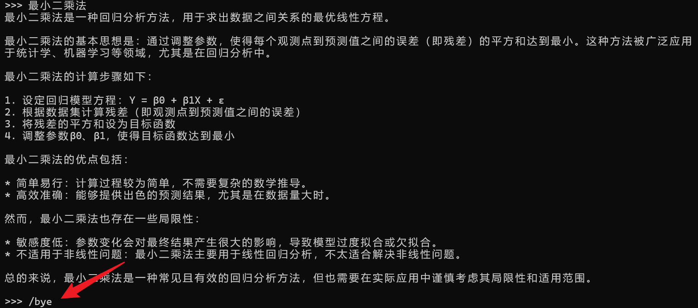

# Ollama 介绍

## 一、Ollama 简介

>"Get up and running with large language models locally."

[Ollama](https://github.com/ollama/ollama) 仓库创建于 2023年6月26日，截至2024年8月，Ollama 经过了一年多的发展。相信在不久的未来，将会在越来越多的边缘端产品中看到大模型的身影。

什么是 Ollama ？正如 Ollama 官方仓库所说：本地启动并运行大型语言模型。

Ollama 是一个开源的大型语言模型服务工具，旨在帮助用户快速在本地运行大模型。通过简单的安装指令，用户可以通过一条命令轻松启动和运行开源的大型语言模型。 它提供了一个简洁易用的命令行界面和服务器，专为构建大型语言模型应用而设计。用户可以轻松下载、运行和管理各种开源 LLM。与传统 LLM 需要复杂配置和强大硬件不同，Ollama 能够让用户在消费级的 PC 上体验 LLM 的强大功能。

Ollama 会自动监测本地计算资源，如有 GPU 的条件，会优先使用 GPU 的资源，同时模型的推理速度也更快。如果没有 GPU 条件，直接使用 CPU 资源。

Ollama 极大地简化了在 Docker 容器中部署和管理大型语言模型的过程，使用户能够迅速在本地启动和运行这些模型。

## 二、Ollama 特点

- **开源免费**：Ollama 及其支持的模型完全开源且免费，用户可以随时访问和使用这些资源，而无需支付任何费用。
- **简单易用**：Ollama 无需复杂的配置和安装过程，只需几条简单的命令即可启动和运行，为用户节省了大量时间和精力。
- **支持多平台**：Ollama 提供了多种安装方式，支持 Mac、Linux 和 Windows 平台，并提供 Docker 镜像，满足不同用户的需求。
- **模型丰富**：Ollama 支持包括 Llama3.1、Gemma2、Qwen2 在内的众多热门开源 LLM，用户可以轻松一键下载和切换模型，享受丰富的选择。
- **功能齐全**：Ollama 将模型权重、配置和数据捆绑成一个包，定义为 Modelfile，使得模型管理更加简便和高效。
- **支持工具调用**：Ollama 支持使用 Llama 3.1 等模型进行工具调用。这使模型能够使用它所知道的工具来响应给定的提示，从而使模型能够执行更复杂的任务。
- **资源占用低**：Ollama 优化了设置和配置细节，包括 GPU 使用情况，从而提高了模型运行的效率，确保在资源有限的环境下也能顺畅运行。
- **隐私保护**：Ollama 所有数据处理都在本地机器上完成，可以保护用户的隐私。
- **社区活跃**：Ollama 拥有一个庞大且活跃的社区，用户可以轻松获取帮助、分享经验，并积极参与到模型的开发和改进中，共同推动项目的发展。

## 三、支持的模型

Ollama 支持的模型库列表 [https://ollama.com/library](https://ollama.com/library 'ollama model library')。

下面是一些受欢迎的模型：

|      Model       |    Tag    | Parameters | Size  | Download                            |
|:----------------:|:---------:|:----------:|:-----:|-------------------------------------|
|   DeepSeek-R1    |     -     |     7B     | 4.7GB | `ollama run deepseek-r1`            |
|   DeepSeek-R1    |     -     |    671B    | 404GB | `ollama run deepseek-r1:671b`       |
|    Llama 3.3     |     -     |    70B     | 43GB  | `ollama run llama3.3`               |
|    Llama 3.2     |     -     |     3B     | 2.0GB | `ollama run llama3.2`               |
|    Llama 3.2     |     -     |     1B     | 1.3GB | `ollama run llama3.2:1b`            |
| Llama 3.2 Vision |  Vision   |    11B     | 7.9GB | `ollama run llama3.2-vision`        |
| Llama 3.2 Vision |  Vision   |    90B     | 55GB  | `ollama run llama3.2-vision:90b`    |
|    Llama 3.1     |     -     |     8B     | 4.7GB | `ollama run llama3.1`               |
|    Llama 3.1     |     -     |    405B    | 231GB | `ollama run llama3.1:405b`          |
|     Gemma 2      |     -     |     2B     | 1.6GB | `ollama run gemma2:2b`              |
|     Gemma 2      |     -     |     9B     | 5.5GB | `ollama run gemma2`                 |
|     Gemma 2      |     -     |    27B     | 16GB  | `ollama run gemma2:27b`             |
|     mistral      |     -     |     7b     | 4.1GB | `ollama run mistral:7b`             |
|       qwen       |     -     |    110b    | 63GB  | `ollama run qwen:110b`              |
|      Phi 4       |     -     |    14B     | 9.1GB | `ollama run phi4`                   |
|    codellama     |   Code    |    70b     | 39GB  | `ollama run codellama:70b`          |
|      qwen2       |     -     |    72b     | 41GB  | `ollama run qwen2:72b`              |
|      llava       |  Vision   |     7b     | 4.7GB | `ollama run llava:7b`               |
| nomic-embed-text | Embedding |    v1.5    | 274MB | `ollama pull nomic-embed-text:v1.5` |


<details>
  <summary>所有支持的模型（数据统计至2024.8.2）。 </summary>

|          Model           |    Tag    | Parameters | Size  | Download                                  |
|:------------------------:|:---------:|:----------:|:-----:|-------------------------------------------|
|         llama3.1         |     -     |    405b    | 231GB | `ollama run llama3.1:405b`                |
|         llama3.1         |     -     |    70b     | 40GB  | `ollama run llama3.1:70b`                 |
|         llama3.1         |     -     |     8b     | 4.7GB | `ollama run llama3.1:8b`                  |
|          gemma2          |     -     |    27b     | 16GB  | `ollama run gemma2:27b`                   |
|          gemma2          |     -     |     9b     | 5.4GB | `ollama run gemma2:9b`                    |
|          gemma2          |     -     |     2b     | 1.6GB | `ollama run gemma2:2b`                    |
|       mistral-nemo       |     -     |    12b     | 7.1GB | `ollama run mistral-nemo:12b`             |
|      mistral-large       |     -     |    123b    | 69GB  | `ollama run mistral-large:123b`           |
|          qwen2           |     -     |    72b     | 41GB  | `ollama run qwen2:72b`                    |
|          qwen2           |     -     |     7b     | 4.4GB | `ollama run qwen2:7b`                     |
|          qwen2           |     -     |    1.5b    | 935MB | `ollama run qwen2:1.5b`                   |
|          qwen2           |     -     |    0.5b    | 352MB | `ollama run qwen2:0.5b`                   |
|    deepseek-coder-v2     |   Code    |    236b    | 133GB | `ollama run deepseek-coder-v2:236b`       |
|    deepseek-coder-v2     |   Code    |    16b     | 8.9GB | `ollama run deepseek-coder-v2:16b`        |
|           phi3           |     -     |    14b     | 7.9GB | `ollama run phi3:14b`                     |
|           phi3           |     -     |    3.8b    | 2.2GB | `ollama run phi3:3.8b`                    |
|         mistral          |     -     |     7b     | 4.1GB | `ollama run mistral:7b`                   |
|         mixtral          |     -     |   8x22b    | 80GB  | `ollama run mixtral:8x22b`                |
|         mixtral          |     -     |    8x7b    | 26GB  | `ollama run mixtral:8x7b`                 |
|        codegemma         |   Code    |     7b     | 5.0GB | `ollama run codegemma:7b`                 |
|        codegemma         |   Code    |     2b     | 1.6GB | `ollama run codegemma:2b`                 |
|        command-r         |     -     |    35b     | 20GB  | `ollama run command-r:35b`                |
|      command-r-plus      |     -     |    104b    | 59GB  | `ollama run command-r-plus:104b`          |
|          llava           |  Vision   |    34b     | 20GB  | `ollama run llava:34b`                    |
|          llava           |  Vision   |    13b     | 8.0GB | `ollama run llava:13b`                    |
|          llava           |  Vision   |     7b     | 4.7GB | `ollama run llava:7b`                     |
|          llama3          |     -     |    70b     | 40GB  | `ollama run llama3:70b`                   |
|          llama3          |     -     |     8b     | 4.7GB | `ollama run llama3:8b`                    |
|          gemma           |     -     |     7b     | 5.0GB | `ollama run gemma:7b`                     |
|          gemma           |     -     |     2b     | 1.7GB | `ollama run gemma:2b`                     |
|           qwen           |     -     |    110b    | 63GB  | `ollama run qwen:110b`                    |
|           qwen           |     -     |    72b     | 41GB  | `ollama run qwen:72b`                     |
|           qwen           |     -     |    32b     | 18GB  | `ollama run qwen:32b`                     |
|           qwen           |     -     |    14b     | 8.2GB | `ollama run qwen:14b`                     |
|           qwen           |     -     |     7b     | 4.5GB | `ollama run qwen:7b`                      |
|           qwen           |     -     |     4b     | 2.3GB | `ollama run qwen:4b`                      |
|           qwen           |     -     |    1.8b    | 1.1GB | `ollama run qwen:1.8b`                    |
|           qwen           |     -     |    0.5b    | 395MB | `ollama run qwen:0.5b`                    |
|          llama2          |     -     |    70b     | 39GB  | `ollama run llama2:70b`                   |
|          llama2          |     -     |    13b     | 7.4GB | `ollama run llama2:13b`                   |
|          llama2          |     -     |     7b     | 3.8GB | `ollama run llama2:7b`                    |
|        codellama         |   Code    |    70b     | 39GB  | `ollama run codellama:70b`                |
|        codellama         |   Code    |    34b     | 19GB  | `ollama run codellama:34b`                |
|        codellama         |   Code    |    13b     | 7.4GB | `ollama run codellama:13b`                |
|        codellama         |   Code    |     7b     | 3.8GB | `ollama run codellama:7b`                 |
|     dolphin-mixtral      |     -     |    8x7b    | 26GB  | `ollama run dolphin-mixtral:8x7b`         |
|     dolphin-mixtral      |     -     |   8x22b    | 80GB  | `ollama run dolphin-mixtral:8x22b`        |
|     nomic-embed-text     | Embedding |    v1.5    | 274MB | `ollama pull nomic-embed-text:v1.5`       |
|    llama2-uncensored     |     -     |    70b     | 39GB  | `ollama run llama2-uncensored:70b`        |
|    llama2-uncensored     |     -     |     7b     | 3.8GB | `ollama run llama2-uncensored:7b`         |
|           phi            |     -     |    2.7b    | 1.6GB | `ollama run phi:2.7b`                     |
|      deepseek-coder      |   Code    |    33b     | 19GB  | `ollama run deepseek-coder:33b`           |
|      deepseek-coder      |   Code    |    6.7b    | 3.8GB | `ollama run deepseek-coder:6.7b`          |
|      deepseek-coder      |   Code    |    1.3b    | 776MB | `ollama run deepseek-coder:1.3b`          |
|     dolphin-mistral      |     -     |     7b     | 4.1GB | `ollama run dolphin-mistral:7b`           |
|        orca-mini         |     -     |    70b     | 39GB  | `ollama run orca-mini:70b`                |
|        orca-mini         |     -     |    13b     | 7.4GB | `ollama run orca-mini:13b`                |
|        orca-mini         |     -     |     7b     | 3.8GB | `ollama run orca-mini:7b`                 |
|        orca-mini         |     -     |     3b     | 2.0GB | `ollama run orca-mini:3b`                 |
|    mxbai-embed-large     | Embedding |    335m    | 670MB | `ollama pull mxbai-embed-large:335m`      |
|      dolphin-llama3      |     -     |    70b     | 40GB  | `ollama run dolphin-llama3:70b`           |
|      dolphin-llama3      |     -     |     8b     | 4.7GB | `ollama run dolphin-llama3:8b`            |
|          zephyr          |     -     |    141b    | 80GB  | `ollama run zephyr:141b`                  |
|          zephyr          |     -     |     7b     | 4.1GB | `ollama run zephyr:7b`                    |
|        starcoder2        |   Code    |    15b     | 9.1GB | `ollama run starcoder2:15b`               |
|        starcoder2        |   Code    |     7b     | 4.0GB | `ollama run starcoder2:7b`                |
|        starcoder2        |   Code    |     3b     | 1.7GB | `ollama run starcoder2:3b`                |
|     mistral-openorca     |     -     |     7b     | 4.1GB | `ollama run mistral-openorca:7b`          |
|            yi            |     -     |    34b     | 19GB  | `ollama run yi:34b`                       |
|            yi            |     -     |     9b     | 5.0GB | `ollama run yi:9b`                        |
|            yi            |     -     |     6b     | 3.5GB | `ollama run yi:6b`                        |
|      llama2-chinese      |     -     |    13b     | 7.4GB | `ollama run llama2-chinese:13b`           |
|      llama2-chinese      |     -     |     7b     | 3.8GB | `ollama run llama2-chinese:7b`            |
|       llava-llama3       |  Vision   |     8b     | 5.5GB | `ollama run llava-llama3:8b`              |
|          vicuna          |     -     |    33b     | 18GB  | `ollama run vicuna:33b`                   |
|          vicuna          |     -     |    13b     | 7.4GB | `ollama run vicuna:13b`                   |
|          vicuna          |     -     |     7b     | 3.8GB | `ollama run vicuna:7b`                    |
|       nous-hermes2       |     -     |    34b     | 19GB  | `ollama run nous-hermes2:34b`             |
|       nous-hermes2       |     -     |   10.7b    | 6.1GB | `ollama run nous-hermes2:10.7b`           |
|        tinyllama         |     -     |    1.1b    | 638MB | `ollama run tinyllama:1.1b`               |
| wizard-vicuna-uncensored |     -     |    30b     | 18GB  | `ollama run wizard-vicuna-uncensored:30b` |
| wizard-vicuna-uncensored |     -     |    13b     | 7.4GB | `ollama run wizard-vicuna-uncensored:13b` |
| wizard-vicuna-uncensored |     -     |     7b     | 3.8GB | `ollama run wizard-vicuna-uncensored:7b`  |
|        codestral         |   Code    |    22b     | 13GB  | `ollama run codestral:22b`                |
|        starcoder         |   Code    |    15b     | 9.0GB | `ollama run starcoder:15b`                |
|        starcoder         |   Code    |     7b     | 4.3GB | `ollama run starcoder:7b`                 |
|        starcoder         |   Code    |     3b     | 1.8GB | `ollama run starcoder:3b`                 |
|        starcoder         |   Code    |     1b     | 726MB | `ollama run starcoder:1b`                 |
|        wizardlm2         |     -     |   8x22b    | 80GB  | `ollama run wizardlm2:8x22b`              |
|        wizardlm2         |     -     |     7b     | 4.1GB | `ollama run wizardlm2:7b`                 |
|         openchat         |     -     |     7b     | 4.1GB | `ollama run openchat:7b`                  |
|           aya            |     -     |    35b     | 20GB  | `ollama run aya:35b`                      |
|           aya            |     -     |     8b     | 4.8GB | `ollama run aya:8b`                       |
|       tinydolphin        |     -     |    1.1b    | 637MB | `ollama run tinydolphin:1.1b`             |
|       stable-code        |   Code    |     3b     | 1.6GB | `ollama run stable-code:3b`               |
|        openhermes        |     -     |    v2.5    | 4.1GB | `ollama run openhermes:v2.5`              |
|       wizardcoder        |   Code    |    33b     | 19GB  | `ollama run wizardcoder:33b`              |
|       wizardcoder        |   Code    |   python   | 3.8GB | `ollama run wizardcoder:python`           |
|         codeqwen         |   Code    |     7b     | 4.2GB | `ollama run codeqwen:7b`                  |
|       wizard-math        |     -     |    70b     | 39GB  | `ollama run wizard-math:70b`              |
|       wizard-math        |     -     |    13b     | 7.4GB | `ollama run wizard-math:13b`              |
|       wizard-math        |     -     |     7b     | 4.1GB | `ollama run wizard-math:7b`               |
|       granite-code       |   Code    |    34b     | 19GB  | `ollama run granite-code:34b`             |
|       granite-code       |   Code    |    20b     | 12GB  | `ollama run granite-code:20b`             |
|       granite-code       |   Code    |     8b     | 4.6GB | `ollama run granite-code:8b`              |
|       granite-code       |   Code    |     3b     | 2.0GB | `ollama run granite-code:3b`              |
|        stablelm2         |     -     |    12b     | 7.0GB | `ollama run stablelm2:12b`                |
|        stablelm2         |     -     |    1.6b    | 983MB | `ollama run stablelm2:1.6b`               |
|       neural-chat        |     -     |     7b     | 4.1GB | `ollama run neural-chat:7b`               |
|        all-minilm        | Embedding |    33m     | 67MB  | `ollama pull all-minilm:33m`              |
|        all-minilm        | Embedding |    22m     | 46MB  | `ollama pull all-minilm:22m`              |
|     phind-codellama      |   Code    |    34b     | 19GB  | `ollama run phind-codellama:34b`          |
|       dolphincoder       |   Code    |    15b     | 9.1GB | `ollama run dolphincoder:15b`             |
|       dolphincoder       |   Code    |     7b     | 4.2GB | `ollama run dolphincoder:7b`              |
|       nous-hermes        |     -     |    13b     | 7.4GB | `ollama run nous-hermes:13b`              |
|       nous-hermes        |     -     |     7b     | 3.8GB | `ollama run nous-hermes:7b`               |
|         sqlcoder         |   Code    |    15b     | 9.0GB | `ollama run sqlcoder:15b`                 |
|         sqlcoder         |   Code    |     7b     | 4.1GB | `ollama run sqlcoder:7b`                  |
|     llama3-gradient      |     -     |    70b     | 40GB  | `ollama run llama3-gradient:70b`          |
|     llama3-gradient      |     -     |     8b     | 4.7GB | `ollama run llama3-gradient:8b`           |
|       starling-lm        |     -     |     7b     | 4.1GB | `ollama run starling-lm:7b`               |
|          xwinlm          |     -     |    13b     | 7.4GB | `ollama run xwinlm:13b`                   |
|          xwinlm          |     -     |     7b     | 3.8GB | `ollama run xwinlm:7b`                    |
|       yarn-llama2        |     -     |    13b     | 7.4GB | `ollama run yarn-llama2:13b`              |
|       yarn-llama2        |     -     |     7b     | 3.8GB | `ollama run yarn-llama2:7b`               |
|       deepseek-llm       |     -     |    67b     | 38GB  | `ollama run deepseek-llm:67b`             |
|       deepseek-llm       |     -     |     7b     | 4.0GB | `ollama run deepseek-llm:7b`              |
|      llama3-chatqa       |     -     |    70b     | 40GB  | `ollama run llama3-chatqa:70b`            |
|      llama3-chatqa       |     -     |     8b     | 4.7GB | `ollama run llama3-chatqa:8b`             |
|          orca2           |     -     |    13b     | 7.4GB | `ollama run orca2:13b`                    |
|          orca2           |     -     |     7b     | 3.8GB | `ollama run orca2:7b`                     |
|          solar           |     -     |   10.7b    | 6.1GB | `ollama run solar:10.7b`                  |
|     samantha-mistral     |     -     |     7b     | 4.1GB | `ollama run samantha-mistral:7b`          |
|       dolphin-phi        |     -     |    2.7b    | 1.6GB | `ollama run dolphin-phi:2.7b`             |
|      stable-beluga       |     -     |    70b     | 39GB  | `ollama run stable-beluga:70b`            |
|      stable-beluga       |     -     |    13b     | 7.4GB | `ollama run stable-beluga:13b`            |
|      stable-beluga       |     -     |     7b     | 3.8GB | `ollama run stable-beluga:7b`             |
|        moondream         |  Vision   |    1.8b    | 1.7GB | `ollama run moondream:1.8b`               |
|  snowflake-arctic-embed  | Embedding |    335m    | 669MB | `ollama pull snowflake-arctic-embed:335m` |
|  snowflake-arctic-embed  | Embedding |    137m    | 274MB | `ollama pull snowflake-arctic-embed:137m` |
|  snowflake-arctic-embed  | Embedding |    110m    | 219MB | `ollama pull snowflake-arctic-embed:110m` |
|  snowflake-arctic-embed  | Embedding |    33m     | 67MB  | `ollama pull snowflake-arctic-embed:33m`  |
|  snowflake-arctic-embed  | Embedding |    22m     | 46MB  | `ollama pull snowflake-arctic-embed:22m`  |
|         bakllava         |  Vision   |     7b     | 4.7GB | `ollama run bakllava:7b`                  |
|   wizardlm-uncensored    |     -     |    13b     | 7.4GB | `ollama run wizardlm-uncensored:13b`      |
|       deepseek-v2        |     -     |    236b    | 133GB | `ollama run deepseek-v2:236b`             |
|       deepseek-v2        |     -     |    16b     | 8.9GB | `ollama run deepseek-v2:16b`              |
|        medllama2         |     -     |     7b     | 3.8GB | `ollama run medllama2:7b`                 |
|       yarn-mistral       |     -     |     7b     | 4.1GB | `ollama run yarn-mistral:7b`              |
|        llama-pro         |     -     |  instruct  | 4.7GB | `ollama run llama-pro:instruct`           |
|   nous-hermes2-mixtral   |     -     |    8x7b    | 26GB  | `ollama run nous-hermes2-mixtral:8x7b`    |
|         meditron         |     -     |    70b     | 39GB  | `ollama run meditron:70b`                 |
|         meditron         |     -     |     7b     | 3.8GB | `ollama run meditron:7b`                  |
|        nexusraven        |     -     |    13b     | 7.4GB | `ollama run nexusraven:13b`               |
|          codeup          |   Code    |    13b     | 7.4GB | `ollama run codeup:13b`                   |
|        llava-phi3        |  Vision   |    3.8b    | 2.9GB | `ollama run llava-phi3:3.8b`              |
|       everythinglm       |     -     |    13b     | 7.4GB | `ollama run everythinglm:13b`             |
|           glm4           |     -     |     9b     | 5.5GB | `ollama run glm4:9b`                      |
|        codegeex4         |   Code    |     9b     | 5.5GB | `ollama run codegeex4:9b`                 |
|        magicoder         |   Code    |     7b     | 3.8GB | `ollama run magicoder:7b`                 |
|     stablelm-zephyr      |     -     |     3b     | 1.6GB | `ollama run stablelm-zephyr:3b`           |
|        codebooga         |   Code    |    34b     | 19GB  | `ollama run codebooga:34b`                |
|       mistrallite        |     -     |     7b     | 4.1GB | `ollama run mistrallite:7b`               |
|      wizard-vicuna       |     -     |    13b     | 7.4GB | `ollama run wizard-vicuna:13b`            |
|       duckdb-nsql        |   Code    |     7b     | 3.8GB | `ollama run duckdb-nsql:7b`               |
|       megadolphin        |     -     |    120b    | 68GB  | `ollama run megadolphin:120b`             |
|         goliath          |     -     | 120b-q4_0  | 66GB  | `ollama run goliath:120b-q4_0`            |
|          notux           |     -     |    8x7b    | 26GB  | `ollama run notux:8x7b`                   |
|         falcon2          |     -     |    11b     | 6.4GB | `ollama run falcon2:11b`                  |
|   open-orca-platypus2    |     -     |    13b     | 7.4GB | `ollama run open-orca-platypus2:13b`      |
|          notus           |     -     |     7b     | 4.1GB | `ollama run notus:7b`                     |
|           dbrx           |     -     |    132b    | 74GB  | `ollama run dbrx:132b`                    |
|        internlm2         |     -     |     7b     | 4.5GB | `ollama run internlm2:7b`                 |
|          alfred          |     -     |    40b     | 24GB  | `ollama run alfred:40b`                   |
|   llama3-groq-tool-use   |     -     |    70b     | 40GB  | `ollama run llama3-groq-tool-use:70b`     |
|   llama3-groq-tool-use   |     -     |     8b     | 4.7GB | `ollama run llama3-groq-tool-use:8b`      |
|        mathstral         |     -     |     7b     | 4.1GB | `ollama run mathstral:7b`                 |
|     firefunction-v2      |     -     |    70b     | 40GB  | `ollama run firefunction-v2:70b`          |
|        nuextract         |     -     |    3.8b    | 2.2GB | `ollama run nuextract:3.8b`               |

</details>

最新支持模型请参考：[https://ollama.com/search](https://ollama.com/search)

> 注意：运行 7B 模型至少需要 8GB 内存，运行 13B 模型至少需要 16GB 内存，运行 33B 模型至少需要 32GB 内存。

## 四、Ollama 常用命令

终端输入 `Ollama`，输出如下：

```bash
Usage:
  ollama [flags]
  ollama [command]

Available Commands:
  serve       Start ollama
  create      Create a model from a Modelfile
  show        Show information for a model
  run         Run a model
  stop        Stop a running model
  pull        Pull a model from a registry
  push        Push a model to a registry
  list        List models
  ps          List running models
  cp          Copy a model
  rm          Remove a model
  help        Help about any command

Flags:
  -h, --help      help for ollama
  -v, --version   Show version information

Use "ollama [command] --help" for more information about a command.
```

总结如下：

| 命令              | 描述               |
|-----------------|:-----------------|
| `ollama serve`  | 启动 Ollama        |
| `ollama create` | 从 Modelfile 创建模型 |
| `ollama show`   | 显示模型信息           |
| `ollama run`    | 运行模型             |
| `ollama stop`   | 停止正在运行的模型        |
| `ollama pull`   | 从注册表中拉取模型        |
| `ollama push`   | 将模型推送到注册表        |
| `ollama list`   | 列出所有模型           |
| `ollama ps`     | 列出正在运行的模型        |
| `ollama cp`     | 复制模型             |
| `ollama rm`     | 删除模型             |
| `ollama help`   | 显示任意命令的帮助信息      |

| 标志              | 描述               |
|-----------------|------------------|
| `-h, --help`    | 显示 Ollama 的帮助信息  |
| `-v, --version` | 显示版本信息           |

多行输入命令时，可以使用 `"""` 进行换行。


使用 `"""` 结束换行。


终止 Ollama 模型推理服务，可以使用 `/bye`。



注意：Ollama 进程会一直运行，如果需要终止 Ollama 所有相关进程，可以使用以下命令：

```bash
Get-Process | Where-Object {$_.ProcessName -like '*ollama*'} | Stop-Process
```