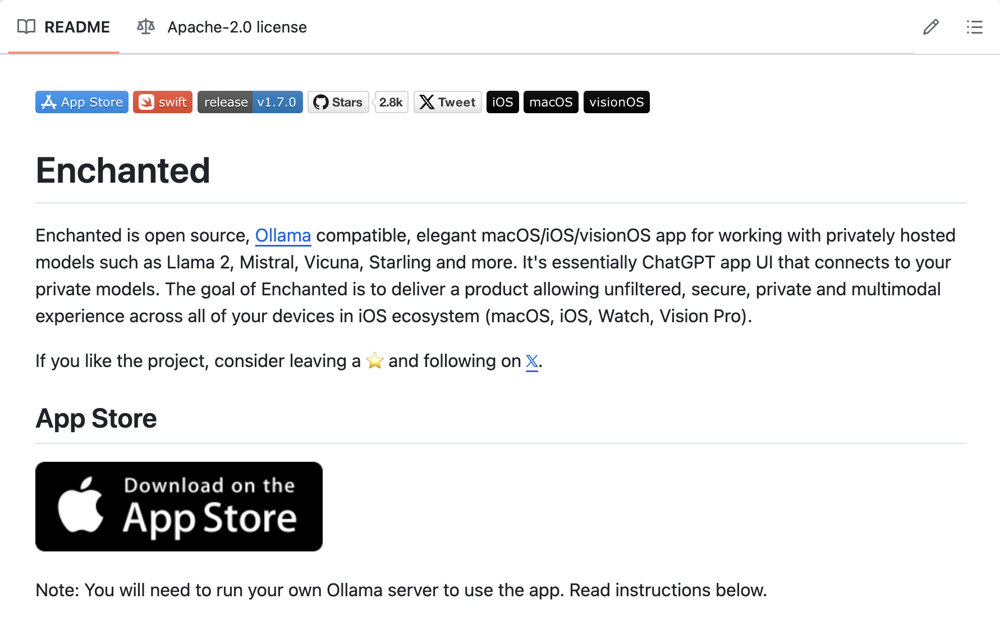
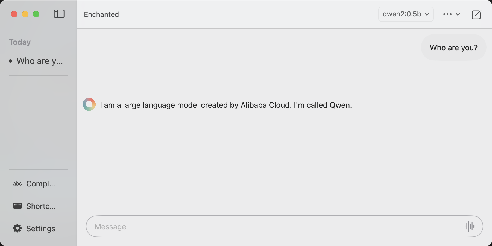

# Ollama 安装与配置 - macOS 系统篇

## 简介

本节学习如何在 macOS 系统中完成 Ollama 的安装与配置，主要分为以下三部分:

* 访问官网直接完成下载
* 运行 Ollama
* 安装 Enchanted

## 一、访问官网直接完成下载

1. 访问官网主页

   > Ollama 下载：https://ollama.com/download
   > 
   > Ollama 官方主页：https://ollama.com
   > 
   > Ollama 官方 GitHub 源代码仓库：[https://github.com/ollama/ollama/](https://github.com/ollama/ollama)

   

2. 等待浏览器下载文件 Ollama-darwin.zip，完成后双击该文件解压，双击解压后文件并将出现如下弹窗。

   

   点击`打开`后会出现如下弹窗，我们点击`Move to Applications`即可。

   
3. 安装完成后，可以右上角状态栏看到 Ollama 图标，点击 `Quit Ollama` 可以退出 Ollama 。

   

## 二、运行 Ollama

- 终端命令启动

```bash
ollama run qwen2:0.5b
```
> 第一次启动需要下载对应模型文件，因此我们选择下载千问2的0.5b版本节省时间。可以点击官网右上角的 [Models](https://ollama.com/library) 获取Ollama支持的模型。

> 加载完成后可以在终端与模型进行对话，`/bye`结束对话。


## 三、安装 Enchanted
Enchanted 是一款开源、兼容 Ollama 的优雅 macOS/iOS/visionOS 应用程序，是一款可以连接私人模型的 ChatGPT 应用程序 UI。可以在 [Enchanted](https://github.com/AugustDev/enchanted) 点击 App Store 进行下载。



我们在运行 Ollama 之后，直接打开 Enchanted 就可以连接到 Ollama。

