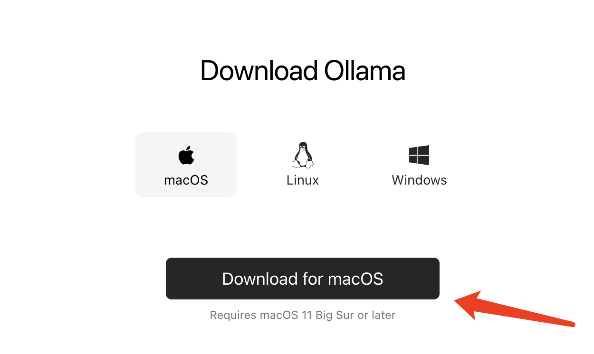
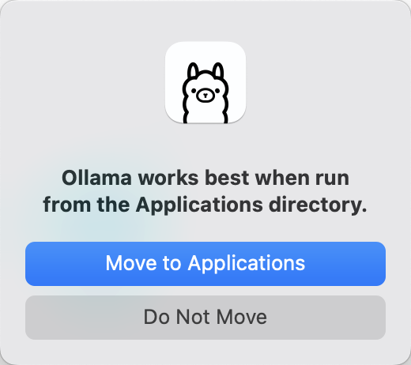
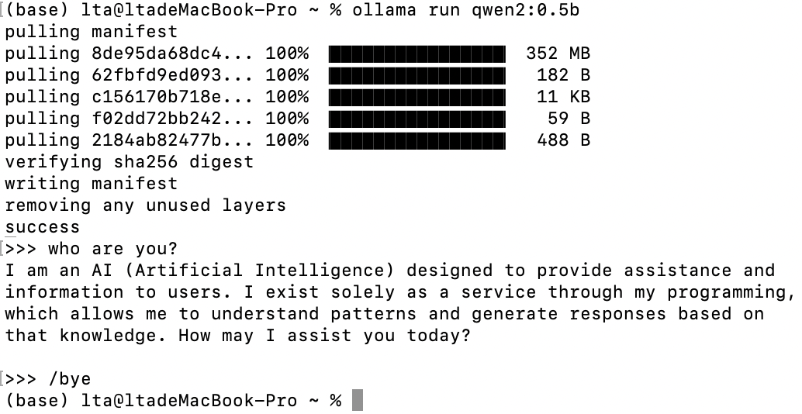

# Ollama安装与配置-macOS系统篇

## 简介

本节学习如何在macOS系统中完成Ollama的安装与配置，主要分为以下两部分:

* 访问官网直接完成下载
* 运行Ollama

## 一、访问官网直接完成下载

1. 访问官网主页

   > [**Ollama**](https://ollama.com/download)官方主页：https://ollama.com/library

   > **Ollama**官方GitHub源代码仓库：[https://github.com/ollama/ollama/](https://github.com/ollama/ollama)
   >

   <div style="text-align:center"></div>

2. 等待浏览器下载文件Ollama-darwin.zip，完成后双击该文件解压，双击解压后文件并将出现如下弹窗。

   

   点击`打开`后会出现如下弹窗，我们点击`Move to Applications`即可。

   
3. 安装完成后，可以右上角状态栏看到Ollama图标，点击 `Quit Ollama` 可以退出Ollama。

   

## 二、运行Ollama

- 终端命令启动

```bash
ollama run qwen2:0.5b
```
> 第一次启动需要下载对应模型文件，因此我们选择下载千问2的0.5b版本节省时间。可以点击官网右上角的[`Models`](https://ollama.com/library)获取Ollama支持的模型。

> 加载完成后可以在终端与模型进行对话，`/bye`结束对话。

<div style="text-align:center"></div>