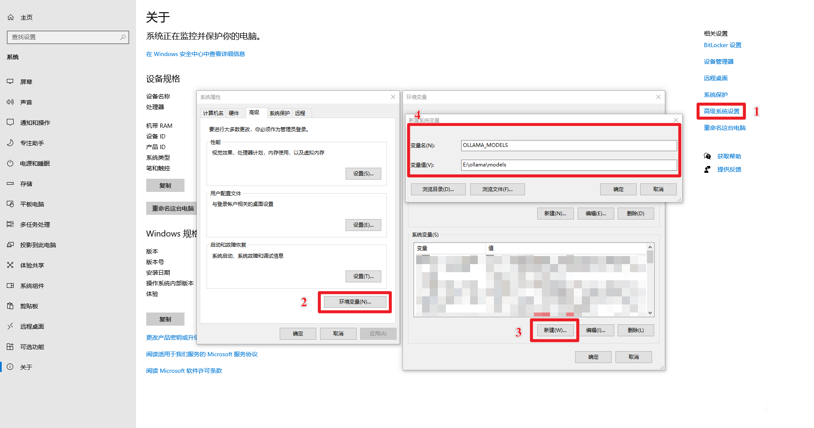
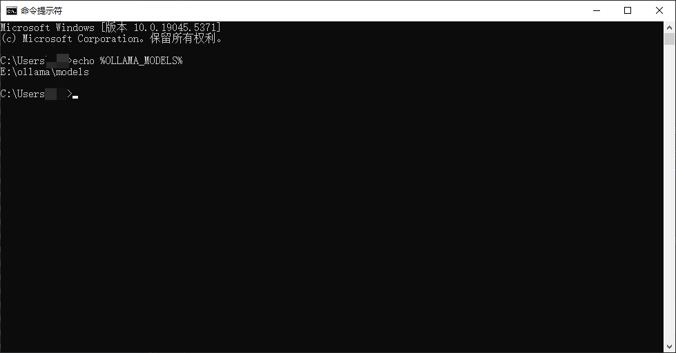

# Ollama 安装与配置 - Windows 系统篇

## 简介

本节学习如何在 Windows 系统中完成 Ollama 的安装与配置，主要分为以下几个部分:

* 访问官网直接完成下载
* 环境变量配置
* 运行 Ollama
* 验证安装成功🎉

## 一、访问官网直接完成下载

1. 访问官网主页

   > Ollama 下载：https://ollama.com/download
   > 
   > Ollama 官方主页：https://ollama.com
   > 
   > Ollama 官方 GitHub 源代码仓库：[https://github.com/ollama/ollama/](https://github.com/ollama/ollama)

   
2. 等待浏览器下载文件 OllamaSetup.exe，完成后双击该文件，出现如下弹窗，点击 `Install` 等待下载完成即可。

   
3. 安装完成后，可以看到 Ollama 已经默认运行了。可以通过底部的导航栏找到 Ollama 标志，并右键后点击 `Quit Ollama` 退出Ollama或者查看 `logs`。

   

## 二、环境变量配置

> **Ollama**可以像其他软件一样在电脑上完成一键安装，不同的是，建议按照实际需求配置下系统环境变量参数。以下是 Ollama 的环境变量配置说明。

| 参数                       | 标识与配置                                                                                                                              |
|--------------------------|------------------------------------------------------------------------------------------------------------------------------------|
| OLLAMA_MODELS            | 表示模型文件的存放目录，默认目录为**当前用户目录**即  `C:\Users%username%.ollama\models`<br />Windows 系统 **建议不要放在C盘**，可放在其他盘（如 `E:\ollama\models`）         |
| OLLAMA_HOST              | 表示ollama 服务监听的网络地址，默认为**127.0.0.1** <br />如果想要允许其他电脑访问 Ollama（如局域网中的其他电脑），**建议设置**成 **0.0.0.0**                                    |
| OLLAMA_PORT              | 表示ollama 服务监听的默认端口，默认为**11434** <br />如果端口有冲突，可以修改设置成其他端口（如**8080**等）                                                              |
| OLLAMA_ORIGINS           | 表示HTTP 客户端的请求来源，使用半角逗号分隔列表<br />如果本地使用不受限制，可以设置成星号 `*`                                                                             |
| OLLAMA_KEEP_ALIVE        | 表示大模型加载到内存中后的存活时间，默认为**5m**即 5 分钟<br />（如纯数字300 代表 300 秒，0 代表处理请求响应后立即卸载模型，任何负数则表示一直存活）<br />建议设置成 **24h** ，即模型在内存中保持 24 小时，提高访问速度 |
| OLLAMA_NUM_PARALLEL      | 表示请求处理的并发数量，默认为**1** （即单并发串行处理请求）<br />建议按照实际需求进行调整                                                                                |
| OLLAMA_MAX_QUEUE         | 表示请求队列长度，默认值为**512** <br />建议按照实际需求进行调整，超过队列长度的请求会被抛弃                                                                              |
| OLLAMA_DEBUG             | 表示输出 Debug 日志，应用研发阶段可以设置成**1** （即输出详细日志信息，便于排查问题）                                                                                  |
| OLLAMA_MAX_LOADED_MODELS | 表示最多同时加载到内存中模型的数量，默认为**1** （即只能有 1 个模型在内存中）                                                                                        |

**对于初学者，我们强烈建议你配置 `OLLAMA_MODELS` 来更改模型存储位置。** 默认情况下，Ollama 模型会存储在 C 盘用户目录下的 `.ollama/models` 文件夹，占用 C 盘空间。  将其更改到其他分区可以更好地管理你的存储。

**步骤 1：找到系统环境变量的设置入口。**

方法 1：开始->设置->关于->高级系统设置->系统属性->环境变量。

方法 2：此电脑->右键->属性->高级系统设置->环境变量。

方法 3：开始->控制面板->系统和安全->系统->高级系统设置->系统属性->环境变量。

方法 4：Win+R 打开运行窗口，输入 `sysdm.cpl`，回车打开系统属性，选择高级选项卡，点击环境变量。

**步骤 2：设置 `OLLAMA_MODELS` 环境变量 (更改模型存储位置)**

1. 在 “**环境变量**” 窗口的 “**系统变量(S)**” 区域 (或者 “用户变量(U)” 区域，根据你的需求选择)，点击 “**新建(W)...**” 按钮。
2. 在 “**变量名(N)**” 输入框中，输入： `OLLAMA_MODELS`  (注意大小写，建议全部大写)。
3. 在 “**变量值(V)**” 输入框中，输入你想要设置的模型存储路径。  **例如，如果你想将模型存储到 E 盘的 `ollama\models` 文件夹下，你可以在 “变量值(V)” 中输入： `E:\ollama\models`**  (请根据你的实际情况修改盘符和文件夹路径)。
    * **注意：**  请确保你输入的路径是 **已经存在的文件夹** 或者 **你希望创建的文件夹的父目录存在**。  Ollama 在首次运行时可能会自动创建 `models` 文件夹，但最好提前创建好 `ollama` 文件夹，确保路径的正确性。
    * **示例：**  为了将模型存储到 E 盘的 `ollama\models` 文件夹，你可以在 “变量值(V)” 中输入：  `E:\ollama\models`
4. 点击 “**确定**” 按钮，关闭 “**新建系统变量**” (或者 “新建用户变量”) 窗口。

> **注意：** 如果你不知道如何设置 `OLLAMA_MODELS` 环境变量，可以参考下面的示例。



**(可选) 设置 `OLLAMA_HOST` 环境变量 (修改监听地址)。**

如果你需要让局域网内的其他设备也能访问你的 Ollama 服务，可以配置 `OLLAMA_HOST` 环境变量。

1. 同样在 “**环境变量**” 窗口的 “**系统变量(S)**” 区域 (或者 “用户变量(U)” 区域)，点击 “**新建(W)...**” 按钮。
2. 在 “**变量名(N)**” 输入框中，输入： `OLLAMA_HOST`
3. 在 “**变量值(V)**” 输入框中，输入 `0.0.0.0:11434`  (或者你想要指定的端口号，默认端口是 11434)。
    * `0.0.0.0` 表示监听所有网络接口，允许局域网访问。
    * `11434` 是 Ollama 默认端口。
    * **示例：**  `0.0.0.0:11434`
4. 点击 “**确定**” 按钮，关闭 “**新建系统变量**” (或者 “新建用户变量”) 窗口。

**步骤 3：重启 Ollama 或 PowerShell 使环境变量生效**

环境变量设置完成后，你需要 **重启 Ollama 服务** 或者 **重新启动你的 命令提示符 (CMD) 或 PowerShell 窗口**，才能让新的环境变量生效。

* **重启 Ollama 服务:** 如果你运行了 `ollama serve`，先 `Ctrl + C` 停止，再重新运行 `ollama serve`。
* **重启命令提示符/PowerShell:** 关闭所有已打开的窗口，重新打开新的窗口。

**步骤 4：验证环境变量是否生效**

1. 重新打开 **命令提示符 (CMD)** 或者 **PowerShell**。

2. **验证 `OLLAMA_MODELS`:** 输入以下命令并回车：
```bash
echo %OLLAMA_MODELS%
```

> 输出：`E:\ollama\models`  (如果你设置的是 `E:\ollama\models`)



## 三、运行Ollama

- 命令行语句启动

```bash
ollama serve
```

> 启动 Ollama 时会报错如下，因为 Windows 系统安装 Ollama 时会**默认开机启动**，**Ollama** 服务默认是 http://127.0.0.1:11434
>
> `Error: listen tcp 127.0.0.1:11434: bind: Only one usage of each socket address (protocol/network address/port) is normally permitted.`

- 解决方法：

1. 快捷键 `Win+X` 打开任务管理器，点击 `启动`，禁用 Ollama，并在**进程**中结束 Ollama 的任务。

   
2. 再次使用 `ollama serve`打开 Ollama。

- 验证成功启动：

1. 快捷键 `Win+R`，输入 `cmd`，打开命令行终端。
2. 输入 `netstat -aon|findstr 11434` 查看占用端口11434的进程。

```bash
netstat -aon|findstr 11434
```

> 输出：` TCP 127.0.0.1:11434 0.0.0.0:0 LISTENING 17556`
>
> 显示11434端口被17556进程占用

3. 查看该进程运行的情况，发现 Ollama 已经启动。

```bash
tasklist|findstr "17556"
```

> 输出如下：`ollama.exe 17556 Console 1 31,856 K`

## 四、验证安装成功🎉

- 终端输入：

```bash
ollama -h
```

输出如下：即表示安装成功🎉

```bash

Large language model runner

Usage:
  ollama [flags]
  ollama [command]

Available Commands:
  serve       Start ollama
  create      Create a model from a Modelfile
  show        Show information for a model
  run         Run a model
  pull        Pull a model from a registry
  push        Push a model to a registry
  list        List models
  ps          List running models
  cp          Copy a model
  rm          Remove a model
  help        Help about any command

Flags:
  -h, --help      help for ollama
  -v, --version   Show version information
```

- 终端使用Ollama :


> [library (ollama.com)](https://ollama.com/library) 这里是ollama的模型库，搜索你想要的模型，然后直接启动！

```bash
ollama run llama3
```

> 下载速度取决于你的带宽，下载完毕即可使用✌记得使用 `control + D` 退出聊天


## 五、如何取消开机自启

（截至2024-08-19）目前 Ollama 在 Windows 系统下默认开机自启，如果不需要开机自启，可以通过以下步骤取消。

打开任务管理器，点击 `启动应用`，找到 `ollama.exe` ，右键点击 `禁用` 即可。


## 参考链接

- [Ollama完整教程：本地LLM管理、WebUI对话、Python/Java客户端API应用](https://www.cnblogs.com/obullxl/p/18295202/NTopic2024071001)
