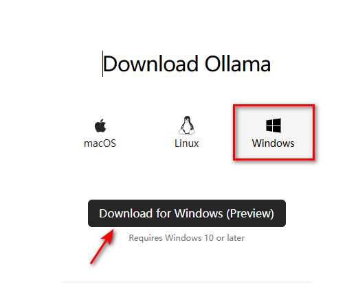
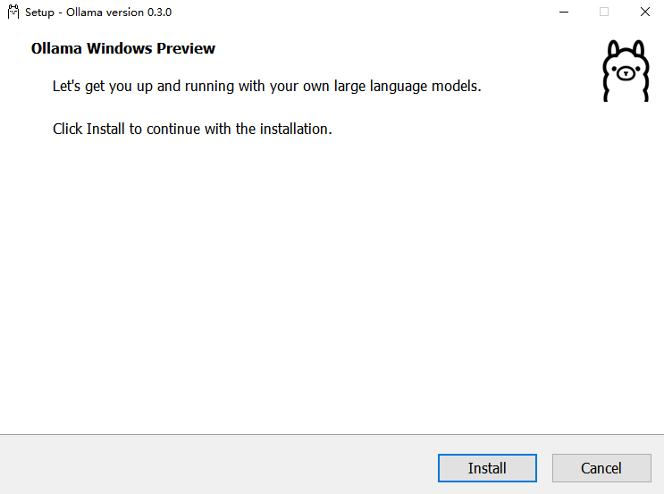
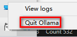
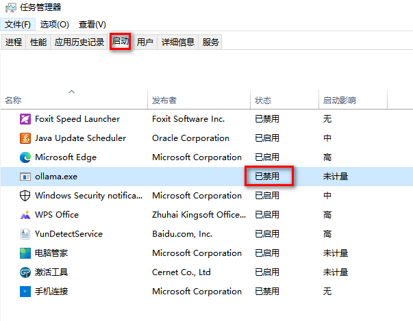
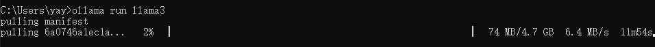
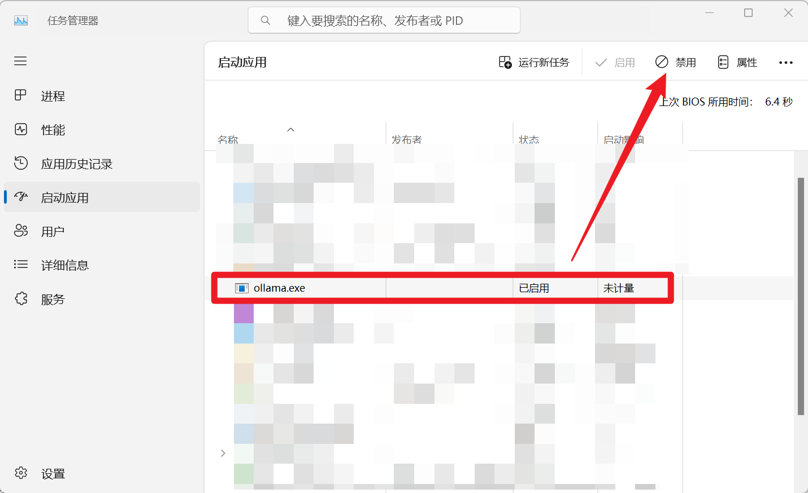

# Ollama 安装与配置 - Windows 系统篇

## 简介

本节学习如何在 Windows 系统中完成 Ollama 的安装与配置，主要分为以下几个部分:

* 访问官网直接完成下载
* 环境变量配置
* 运行 Ollama
* 验证安装成功🎉

## 一、访问官网直接完成下载

1. 访问官网主页

   > Ollama 下载：https://ollama.com/download
   > 
   > Ollama 官方主页：https://ollama.com
   > 
   > Ollama 官方 GitHub 源代码仓库：[https://github.com/ollama/ollama/](https://github.com/ollama/ollama)

   
2. 等待浏览器下载文件 OllamaSetup.exe，完成后双击该文件，出现如下弹窗，点击 `Install` 等待下载完成即可。

   
3. 安装完成后，可以看到 Ollama 已经默认运行了。可以通过底部的导航栏找到 Ollama 标志，并右键后点击 `Quit Ollama` 退出Ollama或者查看 `logs`。

   

## 二、环境变量配置

> **Ollma**可以像其他软件一样在电脑上完成一键安装，不同的是，建议按照实际需求配置下系统环境变量参数

| 参数                     | 标识与配置                                                                                                                                                                                                                          |
| ------------------------ | ----------------------------------------------------------------------------------------------------------------------------------------------------------------------------------------------------------------------------------- |
| OLLAMA_MODELS            | 表示模型文件的存放目录，默认目录为**当前用户目录**即  `C:\Users%username%.ollama\models`<br />Windows 系统 **建议不要放在C盘**，可放在其他盘（如 `E:\ollama\models`）                                             |
| OLLAMA_HOST              | 表示ollama 服务监听的网络地址，默认为**127.0.0.1** <br />如果想要允许其他电脑访问 Ollama（如局域网中的其他电脑），**建议设置**成 **0.0.0.0**                                                                    |
| OLLAMA_PORT              | 表示ollama 服务监听的默认端口，默认为**11434** <br />如果端口有冲突，可以修改设置成其他端口（如**8080**等）                                                                                                            |
| OLLAMA_ORIGINS           | 表示HTTP 客户端的请求来源，使用半角逗号分隔列表<br />如果本地使用不受限制，可以设置成星号 `*`                                                                                                                                     |
| OLLAMA_KEEP_ALIVE        | 表示大模型加载到内存中后的存活时间，默认为**5m**即 5 分钟<br />（如纯数字300 代表 300 秒，0 代表处理请求响应后立即卸载模型，任何负数则表示一直存活）<br />建议设置成 **24h** ，即模型在内存中保持 24 小时，提高访问速度 |
| OLLAMA_NUM_PARALLEL      | 表示请求处理的并发数量，默认为**1** （即单并发串行处理请求）<br />建议按照实际需求进行调整                                                                                                                                   |
| OLLAMA_MAX_QUEUE         | 表示请求队列长度，默认值为**512** <br />建议按照实际需求进行调整，超过队列长度的请求会被抛弃                                                                                                                                  |
| OLLAMA_DEBUG             | 表示输出 Debug 日志，应用研发阶段可以设置成**1** （即输出详细日志信息，便于排查问题）                                                                                                                                        |
| OLLAMA_MAX_LOADED_MODELS | 表示最多同时加载到内存中模型的数量，默认为**1** （即只能有 1 个模型在内存中）                                                                                                                                                |

> 默认的模型保存路径在C盘，我们把路径更改到有更多可用空间的分区或目录，可以更好地管理存储空间。

- 添加 `OLLAMA_MODELS` 环境变量改变模型存储的位置。例如 `E:\ollama\models`
- 设置完成后重启 `ollama` 或 `PowerShell`，即可完成更改。

## 三、运行Ollama

- 命令行语句启动

```bash
ollama serve
```

> 启动 Ollama 时会报错如下，因为 Windows 系统安装 Ollama 时会**默认开机启动**，**Ollama** 服务默认是 http://127.0.0.1:11434
>
> `Error: listen tcp 127.0.0.1:11434: bind: Only one usage of each socket address (protocol/network address/port) is normally permitted.`

- 解决方法：

1. 快捷键 `Win+X` 打开任务管理器，点击 `启动`，禁用 Ollama，并在**进程**中结束 Ollama 的任务。

   
2. 再次使用 `ollama serve`打开 Ollama。

- 验证成功启动：

1. 快捷键 `Win+R`，输入 `cmd`，打开命令行终端。
2. 输入 `netstat -aon|findstr 11434` 查看占用端口11434的进程。

```bash
netstat -aon|findstr 11434
```

> 输出：` TCP 127.0.0.1:11434 0.0.0.0:0 LISTENING 17556`
>
> 显示11434端口被17556进程占用

3. 查看该进程运行的情况，发现 Ollama 已经启动。

```bash
tasklist|findstr "17556"
```

> 输出如下：`ollama.exe 17556 Console 1 31,856 K`

## 四、验证安装成功🎉

- 终端输入：

```bash
ollama -h
```

输出如下：即表示安装成功🎉

```bash

Large language model runner

Usage:
  ollama [flags]
  ollama [command]

Available Commands:
  serve       Start ollama
  create      Create a model from a Modelfile
  show        Show information for a model
  run         Run a model
  pull        Pull a model from a registry
  push        Push a model to a registry
  list        List models
  ps          List running models
  cp          Copy a model
  rm          Remove a model
  help        Help about any command

Flags:
  -h, --help      help for ollama
  -v, --version   Show version information
```

- 终端使用Ollama :


> [library (ollama.com)](https://ollama.com/library) 这里是ollama的模型库，搜索你想要的模型，然后直接启动！

```bash
ollama run llama3
```

> 下载速度取决于你的带宽，下载完毕即可使用✌记得使用 `control + D` 退出聊天




## 五、如何取消开机自启

（截至2024-08-19）目前 Ollama 在 Windows 系统下默认开机自启，如果不需要开机自启，可以通过以下步骤取消。

打开任务管理器，点击 `启动应用`，找到 `ollama.exe` ，右键点击 `禁用` 即可。




## 参考链接

- [Ollama完整教程：本地LLM管理、WebUI对话、Python/Java客户端API应用](https://www.cnblogs.com/obullxl/p/18295202/NTopic2024071001)
