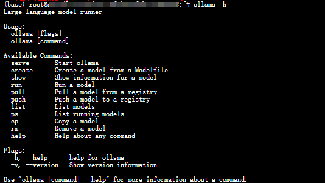
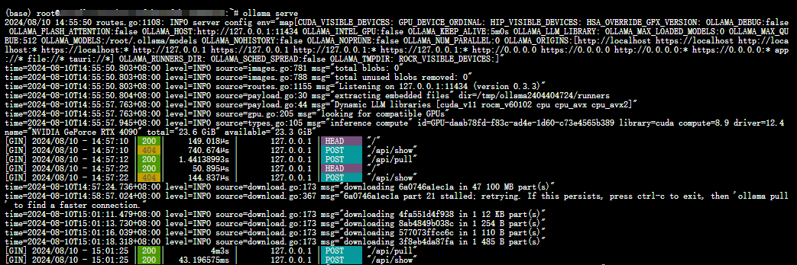
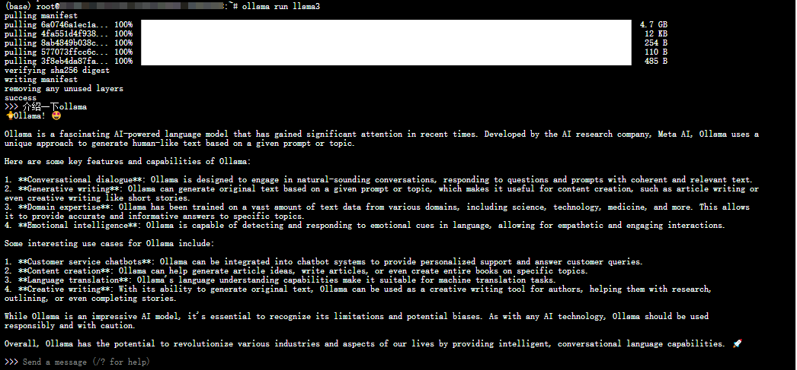

# Ollama 安装与配置 - Linux 系统篇

## 简介

本节学习如何在 Linux 系统中完成 Ollama 的安装与配置，以及对 Ollama 更新，特定版本的安装，查看日志和卸载。

## 一、快速安装

> Ollama 下载：https://ollama.com/download
> 
> Ollama 官方主页：https://ollama.com
> 
> Ollama 官方 GitHub 源代码仓库：[https://github.com/ollama/ollama/](https://github.com/ollama/ollama)
> 
> 官网提供了一条命令行快速安装的方法。


```shell
curl -fsSL https://ollama.com/install.sh | sh
```


此命令将自动下载最新版本的 Ollama 并完成安装，以下是 Ollama 使用常见的指令：

```bash

ollama serve         #启动ollama
ollama create        #从模型文件创建模型
ollama show          #显示模型信息
ollama run           #运行模型
ollama pull          #从注册表中拉取模型
ollama push          #将模型推送到注册表
ollama list          #列出模型
ollama cp            #复制模型
ollama rm            #删除模型
ollama help          #获取有关任何命令的帮助信息
```

- 验证安装完成，在 `Exec` 处输入：

```bash
ollama -h
```

输出如下：即表示安装成功🎉



- 开启并使用 Ollama

首先，在终端中开启 Ollama，并在后台挂起

```shell
ollama serve
```



>  [library (ollama.com)](https://ollama.com/library)这里是 Ollama 的模型库，搜索你想要的模型，开启新的终端，启动！

```bash
ollama run llama3
```

> 下载速度取决于你的带宽，下载完毕即可使用✌记得使用 `control + D` 退出聊天



## 二、手动安装
> 注意： 如果之前已经安装了旧版本的ollama，那么需要先完成手动卸载，`sudo rm -rf /usr/lib/ollama`
> 更多需求👉参考[官网](https://github.com/ollama/ollama/blob/main/docs/linux.md)

### 2.1 下载并解压与操作系统匹配的安装包

```shell
curl -L https://ollama.com/download/ollama-linux-amd64.tgz -o ollama-linux-amd64.tgz
sudo tar -C /usr -xzf ollama-linux-amd64.tgz
```

**AMD GPU**下载：

```shell
curl -L https://ollama.com/download/ollama-linux-amd64-rocm.tgz -o ollama-linux-amd64-rocm.tgz
sudo tar -C /usr -xzf ollama-linux-amd64-rocm.tgz
```

**ARM 64**下载：

```shell
curl -L https://ollama.com/download/ollama-linux-arm64.tgz -o ollama-linux-arm64.tgz
sudo tar -C /usr -xzf ollama-linux-arm64.tgz
```

### 2.2 启动 Ollama并验证

输入以下命令启动 Ollama：

```shell
ollama serve
```

另开启一个终端，输入以下命令，验证ollama是否运行成功
```shell
ollama -v
```

### 2.3 将 Ollama 添加为自启动服务（推荐）

首先，为 Ollama 创建用户和组：

```shell
sudo useradd -r -s /bin/false -U -m -d /usr/share/ollama ollama
sudo usermod -a -G ollama $(whoami)
```

然后在该位置：`/etc/systemd/system/ollama.service` 创建服务文件

```ini
[Unit]
Description=Ollama Service
After=network-online.target

[Service]
ExecStart=/usr/bin/ollama serve
User=ollama
Group=ollama
Restart=always
RestartSec=3
Environment="PATH=$PATH"

[Install]
WantedBy=default.target
```

最后启动服务：

```shell
sudo systemctl daemon-reload
sudo systemctl enable ollama
```


## 三、更新

再次运行之前的安装语句来更新 Ollama：

```shell
curl -fsSL https://ollama.com/install.sh | sh
```

或者重新下载最新的Ollama包：

```shell
curl -L https://ollama.com/download/ollama-linux-amd64.tgz -o ollama-linux-amd64.tgz
sudo tar -C /usr -xzf ollama-linux-amd64.tgz
```

## 四、安装特定版本

设置 `OLLAMA_VERSION`字段，，可以安装对应的版本

```
curl -fsSL https://ollama.com/install.sh | OLLAMA_VERSION=0.5.7 sh
```

## 五、查看日志

查看作为启动服务运行的 Ollama 的日志：

```shell
journalctl -e -u ollama
```

## 六、卸载

- 删除 Ollama 服务：

```shell
sudo systemctl stop ollama
sudo systemctl disable ollama
sudo rm /etc/systemd/system/ollama.service
```

- 从 bin 目录中删除 Ollama 二进制文件： `/usr/local/bin `,`/usr/bin` ,`/bin`

```shell
sudo rm $(which ollama)
```

- 删除下载的模型和 Ollama 服务用户和组：

```shell
sudo rm -r /usr/share/ollama
sudo userdel ollama
sudo groupdel ollama
```

- 删除下载的库文件
```shell
sudo rm -rf /usr/local/lib/ollama
```
