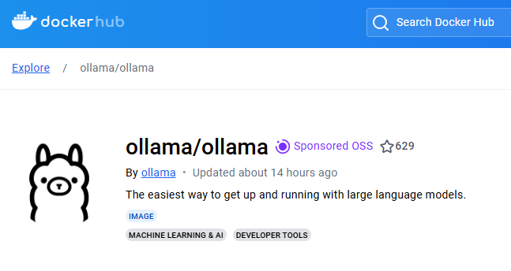
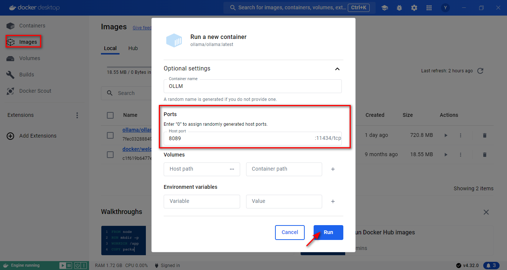
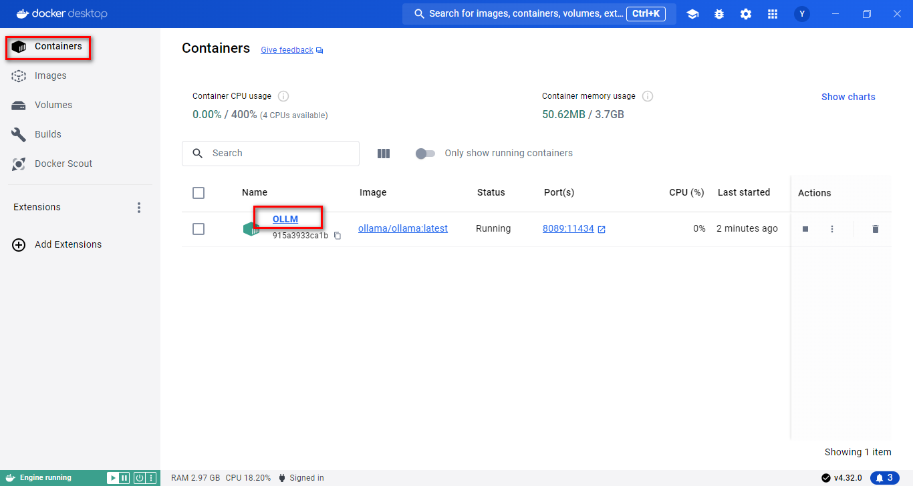
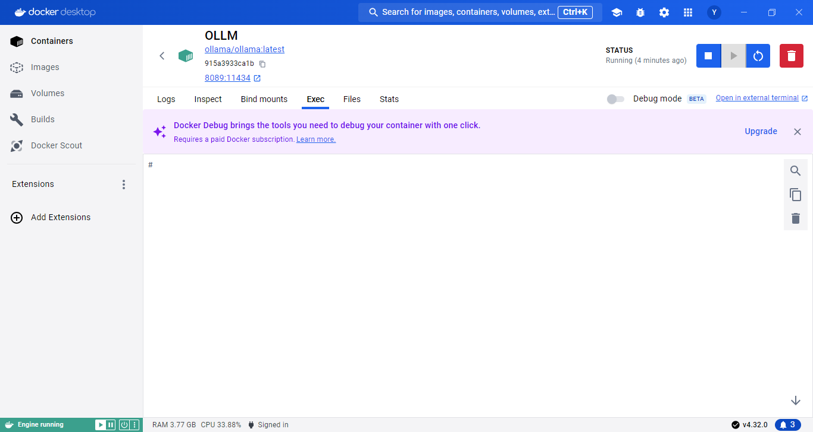

# Ollama 安装与配置 - docker 篇

## 简介

本节学习如何在 Docker 中完成 Ollama 的安装与配置。

> Docker是一种虚拟化的容器技术，其基于镜像，可以秒级启动各种容器。其中的每一种容器都是一个完整的运行环境，可以实现容器之间的隔离。
>
> [**Ollama**](https://ollama.com/download)官方主页：https://ollama.com/library
> 
> **Ollama**官方GitHub源代码仓库：[https://github.com/ollama/ollama/](https://github.com/ollama/ollama)
>
> docker安装官方教程：https://hub.docker.com/r/ollama/ollama



## 一、拉取 Ollama 镜像

> 笔者事先在Windows系统下载了docker👉[docker安装下载官方网站](https://docs.docker.com/desktop/install/windows-install/)

**方式一：Docker 软件在可视化界面中搜索并下载**


**方式二：官网推荐直接使用下面的指令拉取下载镜像，本项目只需在CPU上即可运行。**

```bash
# CPU 或者 Nvidia GPU 
docker pull ollama/ollama

# AMD GPU
docker pull ollama/ollama:rocm
```

注：如果读者想要使用具体的版本的镜像，明确运行环境，可以使用下面的指令:

```bash
# CPU 或 Nvidia GPU下载ollama 0.3.0
docker pull ollama/ollama:0.3.0
# AMD GPU下载ollama 0.3.0
docker pull ollama/ollama:0.3.0-rocm
```

## 二、运行ollama镜像

**方式一：Docker在可视化界面中运行镜像**

- 下载完成后，可以在 `Images`中找到 `Ollama` 镜像，点击 `run` 标识即可运行，注意运行前在弹出的可选设置里面，选定一个端口号（如8089）。



- 在 `Containers` 中找到该镜像，点击 `OLLM` 即可进入 Ollama 界面



- 验证安装完成，在 `Exec` 处输入：

```bash
ollama -h
```

输出如下：即表示安装成功🎉

```bash

Large language model runner

Usage:
  ollama [flags]
  ollama [command]

Available Commands:
  serve       Start ollama
  create      Create a model from a Modelfile
  show        Show information for a model
  run         Run a model
  pull        Pull a model from a registry
  push        Push a model to a registry
  list        List models
  ps          List running models
  cp          Copy a model
  rm          Remove a model
  help        Help about any command

Flags:
  -h, --help      help for ollama
  -v, --version   Show version information
```



- 终端使用 Ollama :

以下是 Ollama 使用常见的指令：

```bash

ollama serve         #启动ollama
ollama create        #从模型文件创建模型
ollama show          #显示模型信息
ollama run           #运行模型
ollama pull          #从注册表中拉取模型
ollama push          #将模型推送到注册表
ollama list          #列出模型
ollama cp            #复制模型
ollama rm            #删除模型
ollama help          #获取有关任何命令的帮助信息
```

> [library (ollama.com)](https://ollama.com/library)这里是 Ollama 的模型库，搜索你想要的模型，然后直接启动！

```bash
ollama run llama3
```

> 下载速度取决于你的带宽，下载完毕即可使用✌记得使用 `control + D` 退出聊天

**方式二：命令行启动**

- CPU 版本：

```shell
docker run -d -v ollama:/root/.ollama -p 11434:11434 --name ollama ollama/ollama
```
