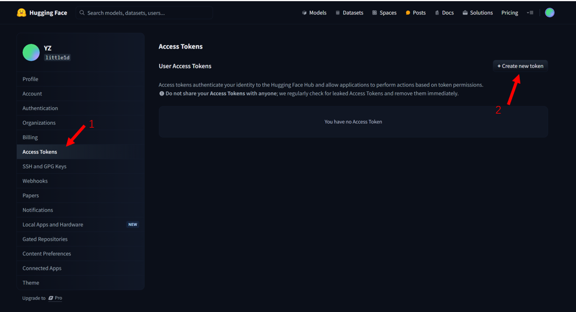
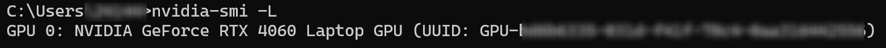
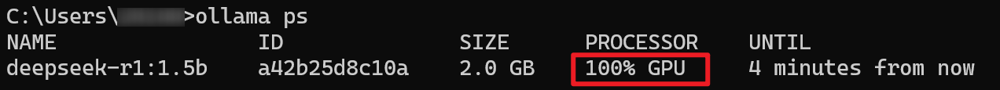

# Ollama自定义导入模型

## 简介
本节学习如何使用Modelfile来自定义导入模型，主要分为以下几个部分:
1. 从GGUF导入
2. 从Pytorch 或 Safetensors导入
3. 由模型直接导入
4. 自定义Prompt


## 一、从GGUF导入

GGUF (GPT-Generated Unified Format) 是一种文件格式，用于保存经过微调的语言模型。这种格式旨在帮助用户方便地在不同的平台和环境之间共享和导入模型。它支持多种量化格式，可以有效减少模型文件的大小。


它的前身是GGML(GPT-Generated Model Language)，是专门为了机器学习而设计的Tensor库，目的是为了有一个单文件的格式，并且易在不同架构的CPU以及GPU上可以推理，但后续由于开发遇到了灵活性不足、相容性及难以维护的问题。


Ollama 支持从 GGUF 文件导入模型，通过以下步骤来实现：
1. 下载.gguf 文件

    > 下载链接：https://huggingface.co/RichardErkhov/Qwen_-_Qwen2-0.5B-gguf/resolve/main/Qwen2-0.5B.Q3_K_M.gguf?download=true

    为了演示的方便，我们选用了 Qwen2-0.5B 模型。下载后复制到第一部分的根目录下

2. 新建创建Modelfile文件
    ```python
    FROM ./Qwen2-0.5B.Q3_K_M.gguf
    ```

3. 在Ollama中创建模型
    ```bash
    ollama create mymodel -f Modelfile
    ```

4. 终端内运行模型（实测在notebook中运行不出来，最好在终端运行）
    ```bash
    ollama run mymodel
    ```


## 二、从Pytorch 或 Safetensors导入

Safetensors 是一种用于存储深度学习模型权重的文件格式，它旨在解决安全性、效率和易用性方面的问题。目前这部分功能还有待社区成员开发，目前文档资源有限。

如果正在导入的模型是以下架构之一，则可以通过Modelfile直接导入Ollama。当然，你也可以将safetensors文件转换为gguf文件，再进行处理，转换过程可以参考第三部分。

> 有关safetensors以及GGUF更详细的信息可以参考这个链接进行学习 https://www.linkedin.com/pulse/llama-3-safetensors-vs-gguf-talles-carvalho-jjcqf

- LlamaForCausalLM
- MistralForCausalLM
- GemmaForCausalLM

由于这部分内容社区还在不断优化中，因此，这里提供的示例代码和流程仅供参考，并不保证能成功运行。详情请参考官方文档。

1. 下载llama-3模型

    ```python
    !pip install huggingface_hub
    ```

    ```python
    # 下载模型
    from huggingface_hub import snapshot_download

    model_id = "unsloth/llama-3-8b-bnb-4bit"
    snapshot_download(
        repo_id=model_id, 
        local_dir="llama-3-8b-bnb-4bit",
        local_dir_use_symlinks=False,
        revision="main",
        # 怎么获取<YOUR_ACCESS_TOKEN>，请参照部分3
        use_auth_token="<YOUR_ACCESS_TOKEN>")
    ```

2. 根目录下创建Modelfile文件，内容如下：
    ```python
    FROM ./llama-3-8b-bnb-4bit
    ```
3. 在Ollama中创建模型
    ```bash
    ollama create mymodel2 -f Modelfile
    ```
4. 运行模型
    ```bash
    ollama run mymodel2
    ```

## 三、由模型直接导入

正常来说，我们在HuggingFace接触到的模型文件非常之多，庆幸的是，hf提供了非常便捷的API来下载和处理这些模型，像上面那样直接下载受限于网络环境，速度非常慢，这一小段我们来使用脚本以及hf来完成。

llama.cpp是GGUF的开源项目，提供CLI和Server功能

对于不能通过Ollama直接转换的架构，我们可以使用llama.cpp进行量化，并将其转换为GGUF格式，再按照第一种方式进行导入。
我们整个转换的过程分为以下几步：
1. 从huggingface上下载model
2. 使用llama.cpp来进行转化
3. 使用llama.cpp来进行模型量化
4. 运行并上传模型

### 3.1 从HuggingFace下载Model
最直觉的下载方式是通过git clone或者链接来下载，但是因为llm每部分都按GB计算，避免出现`OOM Error(Out of memory)`，我们可以使用Python写一个简单的download.py
首先应该去hf拿到用户个人的`ACCESS_TOKEN`，打开 huggingface 。





至此，我们就拿到了一个`ACCESS_TOKEN`，接下来我们使用`huggingface_hub`的`snapshot_download`下载模型，我们这里选择的还是Qwen-0.5b

```jupyter
!pip install huggingface_hub
```

```python
from huggingface_hub import snapshot_download

model_id = "Qwen/Qwen1.5-0.5B" # hugginFace's model name
snapshot_download(
    repo_id=model_id, 
    local_dir="Qwen-0.5b",
    local_dir_use_symlinks=False,
    revision="main",
    use_auth_token="<YOUR_ACCESS_TOKEN>")
```
我们cd到第三部分的目录下执行，下载时间可能会很长，耐心等待。

### 3.2 使用llama.cpp进行转换
llama.cpp是GGML主要作者基于最早的llama的c/c++版本开发的，目的就是希望用CPU来推理各种LLM，在社群的不断努力下现在已经支持大多数主流模型，甚至包括多模态模型。

首先我们克隆llama.cpp库到本地，与下载的模型放在同一目录下：
```jupyter
git clone https://github.com/ggerganov/llama.cpp.git
```
由于使用llama.cpp转换模型的流程基于python开发，需要安装相关的库，推荐使用conda或venv新建一个环境
```jupyter
cd llama.cpp
pip install -r requirements.txt
python convert_hf_to_gguf.py -h
```
如果显示以下内容，说明转换程序已经准备好了。

接下来，我们把刚刚从HuggingFace下载的模型转换为GGUF格式，具体使用以下脚本：
```bash
python convert_hf_to_gguf.py ../Qwen-0.5b --outfile Qwen_instruct_0.5b.gguf --outtype f16
```


可以看到llama.cpp目录下多了一个Qwen_instruct_0.5b.gguf文件，这个过程只需要几秒钟。

为了节省推理时的开销，我们将模型量化，接下来我们开始量化实操。


### 3.3 使用llama.cpp进行模型量化
模型量化是一种技术，将高精度的浮点数模型转换为低精度模型，模型量化的主要目的是减少模型的大小和计算成本，尽可能保持模型的准确性，其目标是使模型能够在资源有限的设备上运行，例如CPU或者移动设备。

同样的，我们先创建Modelfile文件，再使用ollama create命令来从gguf文件中创建我们的模型，不过与第一步稍有不同的是，我们添加了量化逻辑，只需要在执行ollama create是添加一个参数即可。

首先把上一步拿到的Qwen_instruct_0.5b.gguf移动至第三部分的根目录下，再创建Modelfile文件编写以下内容.

```python
FROM ./Qwen_instruct_0.5b.gguf
```

终端运行创建和量化脚本。

```python
# 第三部分根目录下
ollama create -q Q4_K_M mymodel3 -f ./Modelfile
```


到此，我们的模型就量化并创建完成了，接下来我们就可以运行模型了。

### 3.4 运行并上传模型

使用gguf运行模型的步骤详见第一部分，这里不再赘述。

果本地保存的模型文件太占用空间，可以上传gguf模型到huggingface的自己的repo中，同步骤一的思想，我们可以写一个upload的逻辑。

> tips：如果想完成上传，你的HF_ACCESS_TOKEN权限必须要为write，并且要修改你的model_id，your_hf_name指的是你huggingface账号名称

```python
from huggingface_hub import HfApi
import os

api = HfApi()
HF_ACCESS_TOKEN = "<YOUR_HF_WRITE_ACCESS_TOKEN>"
#TODO 这里需要设置你的model_id
#例如 model_id = "little1d/QWEN-0.5b"
model_id = "your_hf_name/QWEN-0.5b"


api.create_repo(
    model_id,
    exist_ok=True,
    repo_type="model", # 上傳格式為模型
    use_auth_token=HF_ACCESS_TOKEN,
)
# upload the model to the hub
# upload model name includes the Bailong-instruct-7B in same folder
for file in os.listdir():
    if file.endswith(".gguf"):
        model_name = file.lower()
        api.upload_file(
            repo_id=model_id,
            path_in_repo=model_name,
            path_or_fileobj=f"{os.getcwd()}/{file}",
            repo_type="model", # 上傳格式為模型
            use_auth_token=HF_ACCESS_TOKE)

```


上传完成后就可以在自己的hf仓库中看到啦！

## 四、自定义Prompt

Ollama支持自定义Prompt，可以让模型生成更符合用户需求的文本。

自定义Prompt的步骤如下：
1. 根目录下创建一个Modelfile文件

    ```python
    FROM llama3.1
    # sets the temperature to 1 [higher is more creative, lower is more coherent]
    PARAMETER temperature 1
    # sets the context window size to 4096, this controls how many tokens the LLM can use as context to generate the next token
    PARAMETER num_ctx 4096

    # sets a custom system message to specify the behavior of the chat assistant
    SYSTEM You are Mario from super mario bros, acting as an assistant.
    ```
2. 创建模型

 ```python
 ollama create mymodel -f ./Modelfile
 ```
 

 创建模型的时间可能稍微会久一点，和pull一个模型的时间差不多，请耐心等待

 


 再次运行`ollama list`查看已有的模型，可以看到mymodel已经正确创建了


 


3. 运行模型

 ```python
 ollama run mymodel
 ```
 
 可以看到，我们的小羊驼🦙已经变成了Mario！自定义Prompt成功！😘😘


## 参考链接
- https://www.linkedin.com/pulse/llama-3-safetensors-vs-gguf-talles-carvalho-jjcqf
- https://www.sysgeek.cn/ollama-on-windows
- https://ollama.com/blog/openai-compatibility