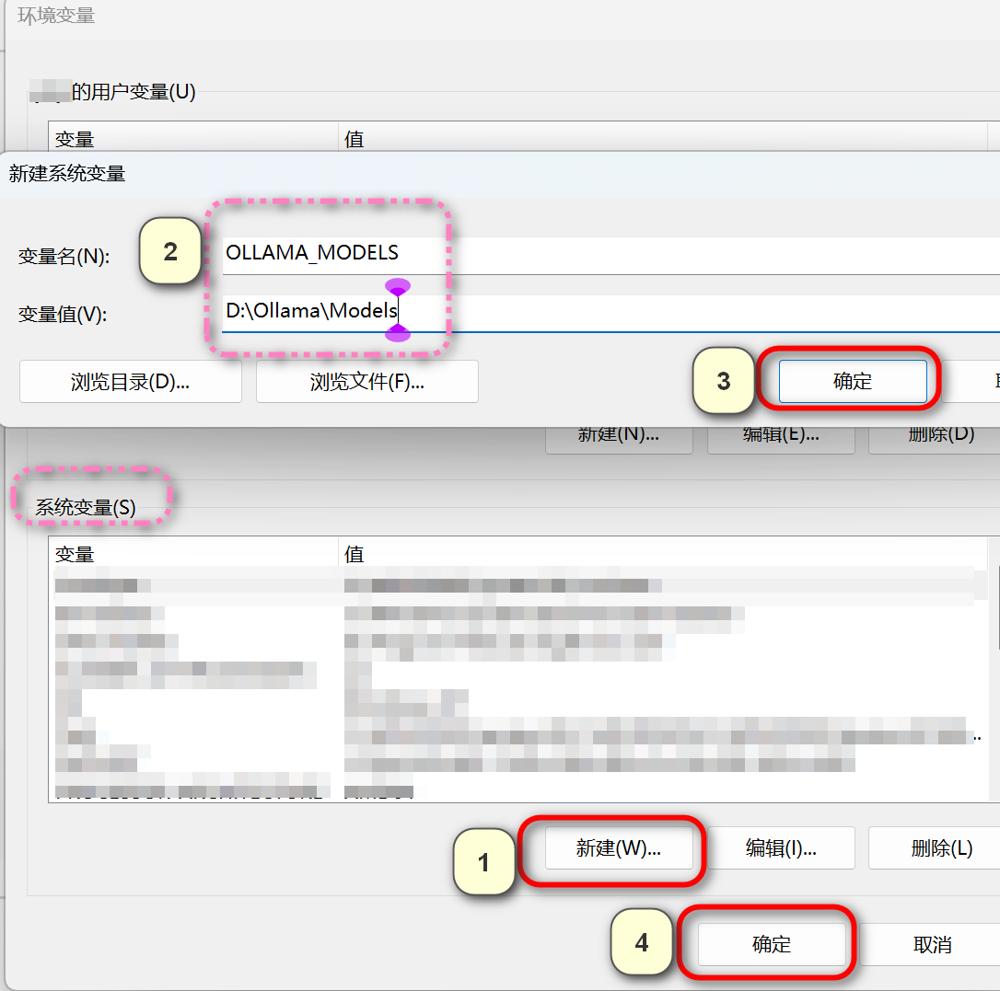
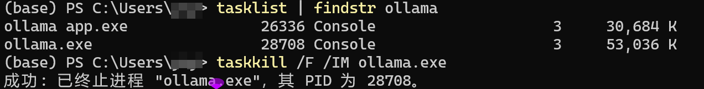

# Ollama 自定义模型存储位置

以 Windows 系统为例，Ollama 拉取的模型默认存储在 C 盘中，若需要拉取多个模型，则让 C 盘爆满，影响 C 盘存储空间。

因此，本节将介绍如何在 Windows、Linux 和 MacOS 三大主流操作系统中自定义 Ollama 模型的存储位置。

## Windows

---

> 在下载Ollama时如果不进行额外操作，模型默认会下载到 `C:\Users\<用户名>\.ollama\models`
>
> 如果不想把它放在C盘，此时我们创建自定义模型下载的文件夹并复制该路径，如 `D:\Ollama\Models`
>
> ❗注意：路径需提前创建且不含中文或空格
>
> 针对不同的情况，可以采取以下策略👀

一、在首次安装Ollama之前，手动设置模型下载路径

二：修改系统环境变量（推荐）

三：迁移现有模型文件

#### **一：在首次安装Ollama时，手动设置模型下载路径**

> 自定义安装路径（首次安装时）

```powershell
.\OllamaSetup.exe /DIR="D:\Ollama\Models"
```

点击 `Install`后，可以看到软件安装在自定义路径文件夹，同时模型也会默认下载到该自定义文件夹内


#### **二：修改系统环境变量（推荐）**

> 适用场景：安装Ollama完成后建议直接修改模型的存储位置或希望新下载的模型直接存放到新位置。

1. 设置环境变量

- `Win + S` → 输入“环境变量” → 选择“编辑系统环境变量” → 点击“环境变量”按钮。
- **系统变量** → **新建** → 输入：
  - **变量名**：`OLLAMA_MODELS`
  - **变量值**：自定义路径（如 `D:\Ollama\Models`）



2. **重启Ollama生效**

- 重启Ollama服务（任务栏右键图标 → `Quit Ollama`，再重新启动）

#### **三：迁移现有模型文件**

> 已下载模型需迁移到新位置

1. **停止Ollama进程**

   查找进程ID

   ```powershell
   tasklist | findstr ollama
   ```

   终止进程

   ```powershell
   taskkill /F /IM ollama.exe
   ```

   
2. 迁移模型文件

- 将 `C:\Users\<用户名>\.ollama\models` 文件夹复制到新位置（如 `D:\Ollama\Models`），并释放存储空间
- ❗**备份数据**：迁移前建议备份 `C:\Users\<用户名>\.ollama` 文件夹

3. 创建环境变量

   - 按方法二设置 `OLLAMA_MODELS` 指向新路径（如 `D:\Ollama\Models`）
4. **重启Ollama生效**

   查看模型列表，如果显示已经下载的模型，那么模型迁移成功🎉

```powershell
ollama list
```

---

## Linux

## MacOS

## 参考链接

- https://www.cnblogs.com/LaiYun/p/18696931
