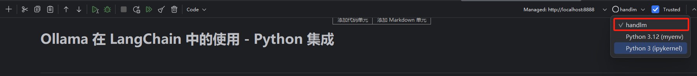

# Ollama 在 LangChain 中的使用 - Python 集成

## 简介

本文档介绍了如何在 Python 环境中使用 Ollama 与 LangChain 集成，以创建强大的 AI 应用。Ollama 是一个开源的大语言模型部署工具，而 LangChain 则是一个用于构建基于语言模型的应用的框架。通过结合这两者，我们可以在本地环境中快速部署和使用先进的AI模型。

> 注: 本文档包含核心代码片段和详细解释。完整代码可在 [Jupyter notebook](https://github.com/datawhalechina/handy-ollama/blob/main/notebook/C5/ollama_langchain_python.ipynb) 中找到。

## 1. 环境设置

### 配置 Conda 环境

首先，我们需要在 Jupyter 中使用 Conda 环境。在命令行中执行以下命令：

```bash
conda create -n handlm python=3.10 -y
conda activate handlm
pip install jupyter
python -m ipykernel install --user --name=handlm
```

执行完毕后，重启 Jupyter，并选择该环境的 Kernel，如图所示：



### ⚠️ 注意
> **注意：** 也可以不使用conda虚拟环境，直接使用全局环境。

### 安装依赖

在开始之前，我们需要安装以下包：

- `langchain-ollama`: 用于集成 Ollama 模型到 LangChain 框架中
- `langchain`: LangChain 的核心库，提供了构建 AI 应用的工具和抽象
- `langchain-community`: 包含了社区贡献的各种集成和工具
- `Pillow`: 用于图像处理，在多模态任务中会用到
- `faiss-cpu`: 用于构建简单 RAG 检索器

可以通过以下命令安装：

```bash
pip install langchain-ollama langchain langchain-community Pillow faiss-cpu
```

## 2. 下载所需模型并初始化 OllamaLLM

### 下载 llama3.1 模型

1. 进入官网 [https://ollama.com/download](https://ollama.com/download) 下载并安装 Ollama 到可用的受支持平台。
2. 查看 [https://ollama.ai/library](https://ollama.ai/library) 了解所有可用的模型。
3. 通过 `ollama pull <name-of-model>` 命令获取可用 LLM 模型（例如：`ollama pull llama3.1`）。

命令行执行完毕后如图所示：


模型存储位置：
- Mac: `~/.ollama/models/`
- Linux（或 WSL）: `/usr/share/ollama/.ollama/models`
- Windows: `C:\Users\Administrator\.ollama\models`


## 3. 基本使用示例

### 使用 ChatPromptTemplate 进行对话

ChatPromptTemplate 允许我们创建一个可重用的模板，其中包含一个或多个参数。这些参数可以在运行时动态替换，以生成不同的提示。

```python
template = """
你是一个乐于助人的AI，擅长于解决回答各种问题。
问题：{question}
"""
prompt = ChatPromptTemplate.from_template(template)
chain = prompt | model
chain.invoke({"question": "你比GPT4厉害吗？"})
```

在创建链部分，使用管道操作符 `|`，它将 prompt 和 model 连接起来，形成一个处理流程。这种链式操作使得我们可以轻松地组合和重用不同的组件。

`invoke` 方法触发整个处理链，将我们的问题传入模板，然后将格式化后的提示发送给模型进行处理。

### 流式输出

流式输出是一种在生成长文本时逐步返回结果的技术。这种方法有几个重要的优势：

1. 提高用户体验：用户可以立即看到部分结果，而不是等待整个响应完成。
2. 减少等待时间：对于长回答，用户可以在完整回答生成之前就开始阅读。
3. 实时交互：允许在生成过程中进行干预或终止。

在实际应用中，特别是在聊天机器人或实时对话系统中，流式输出几乎是必不可少的。

```python
from langchain_ollama import ChatOllama

model = ChatOllama(model="llama3.1", temperature=0.7)

messages = [
    ("human", "你好呀"),
]

for chunk in model.stream(messages):
    print(chunk.content, end='', flush=True)
```

`model.stream()` 方法是对 Ollama API 的流式输出接口的封装，它返回一个生成器（generator）对象。当调用 `model.stream(messages)` 时，会完成以下操作：

- 向 Ollama API 发送请求，开始生成响应。
- API 开始生成文本，但不是等到全部生成完毕才返回，而是一小块一小块地返回。
- 每收到一小块文本，`stream()` 方法就会 yield 这个文本块。
- `flush=True` 确保每个片段立即显示，而不是等待缓冲区填满。

### 工具调用

工具调用是 AI 模型与外部函数或 API 交互的能力。这使得模型可以执行复杂的任务，如数学计算、数据查询或外部服务调用。

```python
def simple_calculator(operation: str, x: float, y: float) -> float:
    '''实际的代码处理逻辑'''

llm = ChatOllama(
    model="llama3.1",
    temperature=0,
).bind_tools([simple_calculator])

result = llm.invoke("你知道一千万乘二是多少吗？")
```

`bind_tools` 方法允许我们将自定义函数注册到模型中。这样，当模型遇到需要计算的问题时，它可以调用这个函数来获得准确的结果，而不是依赖于其预训练知识。

这种能力在构建复杂的 AI 应用时非常有用，例如：

- 创建可以访问实时数据的聊天机器人
- 构建能执行特定任务（如预订、查询等）的智能助手
- 开发能进行精确计算或复杂操作的 AI 系统

### 多模态模型

Ollama 支持多模态模型，如 bakllava 和 llava。多模态模型是能够处理多种类型输入（如文本、图像、音频等）的 AI 模型。这些模型在理解和生成跨模态内容方面表现出色，使得更复杂和自然的人机交互成为可能。

首先，需要下载多模态模型。在命令行执行：

```bash
ollama pull llava
```


然后，我们可以使用以下代码来处理图像和文本输入：

```python
from langchain_ollama import ChatOllama
from langchain_core.messages import HumanMessage
from langchain_core.output_parsers import StrOutputParser

llm = ChatOllama(model="llava", temperature=0)

def prompt_func(data):
    '''构造多模态输入'''

chain = prompt_func | llm | StrOutputParser()

query_chain = chain.invoke(
    {"text": "这个图片里是什么动物啊?", "image": image_b64}
)
```

这里的关键点是：

1. 图像预处理：我们需要将图像转换为 base64 编码的字符串。
2. 提示函数：`prompt_func` 创建了一个包含文本和图像的多模态输入。
3. 链式处理：我们使用 `|` 操作符将提示函数、模型和输出解析器连接起来。

多模态模型在很多场景下都很有用，比如：

- 图像描述生成
- 视觉问答系统
- 基于图像的内容分析和推荐

## 4. 进阶用法

### 使用 ConversationChain 进行对话

`ConversationChain` 是 LangChain 提供的一个强大工具，用于管理多轮对话。它结合了语言模型、提示模板和内存组件，使得创建具有上下文感知能力的对话系统变得简单。

```python
memory = ConversationBufferMemory()

conversation = ConversationChain(
    llm=model,
    memory=memory,
    verbose=True
)

# 进行对话
response = conversation.predict(input="你好，我想了解一下人工智能。")
print("AI:", response)

response = conversation.predict(input="能给我举个AI在日常生活中的应用例子吗？")
print("AI:", response)

response = conversation.predict(input="这听起来很有趣。AI在医疗领域有什么应用？")
print("AI:", response)
```

这里的关键组件是：

1. `ConversationBufferMemory`：这是一个简单的内存组件，它存储所有先前的对话历史。
2. `ConversationChain`：它将语言模型、内存和一个默认的对话提示模板组合在一起。

维护对话历史很重要，因为它允许模型：

- 理解上下文和之前提到的信息
- 生成更连贯和相关的回复
- 处理复杂的多轮对话场景

在实际应用中，你可能需要考虑使用更高级的内存组件，如 `ConversationSummaryMemory`，以处理长对话并避免超出模型的上下文长度限制。

### 自定义提示模板

设计好的提示模板是创建高效 AI 应用的关键。在这个例子中，我们创建了一个用于生成产品描述的复杂提示：

```python
system_message = SystemMessage(content="""
你是一位经验丰富的电商文案撰写专家。你的任务是根据给定的产品信息创作吸引人的商品描述。
请确保你的描述简洁、有力，并且突出产品的核心优势。
""")

human_message_template = """
请为以下产品创作一段吸引人的商品描述：
产品类型: {product_type}
核心特性: {key_feature}
目标受众: {target_audience}
价格区间: {price_range}
品牌定位: {brand_positioning}

请提供以下三种不同风格的描述，每种大约50字：
1. 理性分析型
2. 情感诉求型
3. 故事化营销型
"""

# 示例使用
product_info = {
    "product_type": "智能手表",
    "key_feature": "心率监测和睡眠分析",
    "target_audience": "注重健康的年轻专业人士",
    "price_range": "中高端",
    "brand_positioning": "科技与健康的完美结合"
}
```

这个结构有几个重要的设计考虑：

1. system_prompt：定义了 AI 的角色和总体任务，设置了整个对话的基调。
2. human_message_template：提供了具体的指令和所需信息的结构。
3. 多参数设计：允许灵活地适应不同的产品和需求。
4. 多样化输出要求：通过要求不同风格的描述，鼓励模型展示其多样性。

设计有效的提示模板时，考虑以下几点：

- 明确定义 AI 的角色和任务
- 提供清晰、结构化的输入格式
- 包含具体的输出要求和格式指导
- 考虑如何最大化模型的能力和创造力

### 构建一个简单的 RAG 问答系统

RAG（Retrieval-Augmented Generation）是一种结合了检索和生成的 AI 技术，它通过检索相关信息来增强语言模型的回答能力。RAG 系统的工作流程通常包括以下步骤：

1. 将知识库文档分割成小块并创建向量索引
2. 对用户的问题进行向量化，在索引中检索相关文档
3. 将检索到的相关文档和原始问题一起作为上下文提供给语言模型
4. 语言模型根据检索到的信息生成回答

RAG 的优势在于它可以帮助语言模型访问最新和专业的信息，减少幻觉，并提高回答的准确性和相关性。

LangChain 提供了多种组件，可以与 Ollama 模型无缝集成。这里我们将展示如何将 Ollama 模型与向量存储和检索器结合使用，创建一个简单的 RAG 问答系统。

首先需要确保下载 embedding 模型，可以在命令行执行以下命令：

```bash
ollama pull nomic-embed-text
```

然后，我们可以构建 RAG 系统：

```python
# 初始化 Ollama 模型和嵌入
llm = ChatOllama(model="llama3.1")
embeddings = OllamaEmbeddings(model="nomic-embed-text")

# 准备文档
text = """
Datawhale 是一个专注于数据科学与 AI 领域的开源组织，汇集了众多领域院校和知名企业的优秀学习者，聚合了一群有开源精神和探索精神的团队成员。
Datawhale 以" for the learner，和学习者一起成长"为愿景，鼓励真实地展现自我、开放包容、互信互助、敢于试错和勇于担当。
同时 Datawhale 用开源的理念去探索开源内容、开源学习和开源方案，赋能人才培养，助力人才成长，建立起人与人，人与知识，人与企业和人与未来的联结。
如果你想在Datawhale开源社区发起一个开源项目，请详细阅读Datawhale开源项目指南[https://github.com/datawhalechina/DOPMC/blob/main/GUIDE.md]
"""

# 分割文本
text_splitter = RecursiveCharacterTextSplitter(chunk_size=100, chunk_overlap=20)
chunks = text_splitter.split_text(text)

# 创建向量存储
vectorstore = FAISS.from_texts(chunks, embeddings)
retriever = vectorstore.as_retriever()

# 创建提示模板
template = """只能使用下列内容回答问题:
{context}

Question: {question}
"""
prompt = ChatPromptTemplate.from_template(template)

# 创建检索-问答链
chain = (
    {"context": retriever, "question": RunnablePassthrough()}
    | prompt
    | llm
)

# 使用链回答问题
question = "我想为datawhale贡献该怎么做？"
response = chain.invoke(question)
```

这个 RAG 系统的工作原理如下：

1. 文本分割：使用 `RecursiveCharacterTextSplitter` 将长文本分割成小块。
2. 向量化和索引：使用 `OllamaEmbeddings` 将文本块转换为向量，并用 FAISS 创建向量索引。
3. 检索：当收到问题时，系统会将问题向量化，并在 FAISS 索引中检索最相关的文本块。
4. 生成回答：将检索到的相关文本块与原始问题一起提供给语言模型，生成最终答案。

RAG 系统在许多真实场景中非常有用，例如：

- 客户服务：可以基于公司的知识库快速回答客户询问。
- 研究辅助：帮助研究人员快速找到相关文献并总结关键信息。
- 个人助手：结合个人笔记和网络信息，提供个性化的信息检索和建议。

## 结论

通过这些示例，我们展示了如何使用 Ollama 和 LangChain 构建各种 AI 应用，从简单的对话系统到复杂的 RAG 问答系统。这些工具和技术为开发强大的 AI 应用提供了坚实的基础。

Ollama 和 LangChain 的结合为开发者提供了极大的灵活性和可能性。你可以根据具体需求，选择合适的模型和组件，构建出适合你的应用场景的 AI 系统。

随着技术的不断发展，我们期待看到更多创新的应用出现。希望这个指南能够帮助你开始你的 AI 开发之旅，并激发你的创造力，去探索 AI 技术的无限可能。
