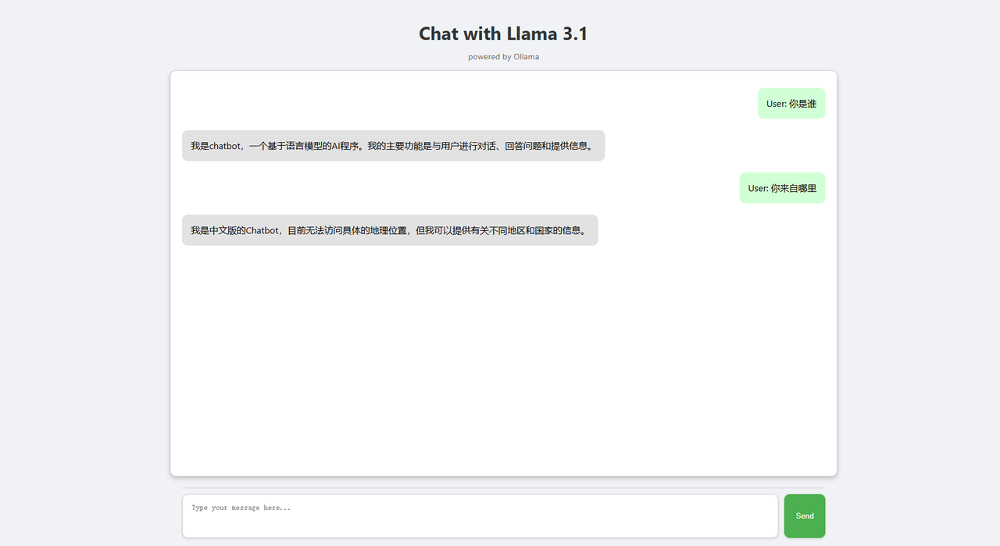
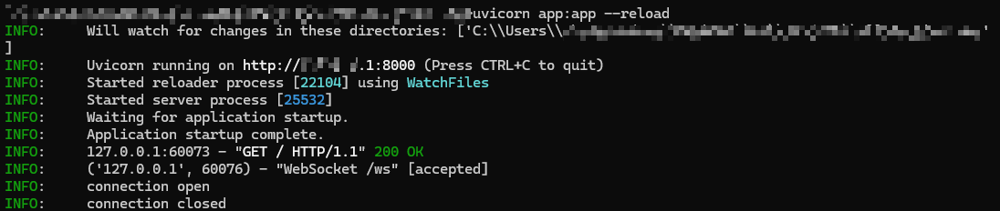

# FastAPI 部署 Ollama 可视化对话界面

## 一、目录结构

仓库 notebook 的 C6 文件夹下：


    fastapi_chat_app/
    │
    ├── app.py
    ├── websocket_handler.py
    ├── static/
    │   └── index.html
    └── requirements.txt


- `app.py`  FastAPI 应用程序的主要设置和路由。
- `websocket_handler.py` 处理 WebSocket 连接和消息流。
- `static/index.html` HTML页面。
- `requirements.txt` 所需依赖，通过 pip install -r requirements.txt 安装。

## 二、克隆本仓库

```bash
git clone https://github.com/AXYZdong/handy-ollama
```

## 三、安装依赖

```bash
pip install -r requirements.txt
```

## 四、核心代码

`app.py` 文件中的核心代码如下：

```python
import ollama
from fastapi import WebSocket

async def websocket_endpoint(websocket: WebSocket):
    await websocket.accept()  # 接受WebSocket连接
    user_input = await websocket.receive_text()  # 接收用户输入的文本消息

    stream = ollama.chat(  # 使用ollama库与指定模型进行对话
        model='llama3.1',  # 指定使用的模型为llama3.1
        messages=[{'role': 'user', 'content': user_input}],  # 传入用户的输入消息
        stream=True  # 启用流式传输
    )

    try:
        for chunk in stream:  # 遍历流式传输的结果
            model_output = chunk['message']['content']  # 获取模型输出的内容
            await websocket.send_text(model_output)  # 通过WebSocket发送模型输出的内容
    except Exception as e:  # 捕获异常
        await websocket.send_text(f"Error: {e}")  # 通过WebSocket发送错误信息
    finally:
        await websocket.close()  # 关闭WebSocket连接
```

**接受 WebSocket 连接：**
- `await websocket.accept()`：首先，函数接受来自客户端的 WebSocket 连接请求，建立与客户端的通信通道。

**接收用户输入：**
- `user_input = await websocket.receive_text()`：通过 WebSocket 从客户端接收一条文本消息，获取用户输入的内容。

**初始化对话流：**
- `stream = ollama.chat(...)`：调用 ollama 库中的 chat 方法，指定使用的模型为 llama3.1。将用户的输入作为消息传递给模型，并启用流式传输（stream=True），以便逐步获取模型生成的回复。

**处理模型输出：**
- `for chunk in stream`：遍历从模型中流式传输过来的数据块。
- `model_output = chunk['message']['content']`：从每个数据块中提取出模型生成的文本内容。
- `await websocket.send_text(model_output)`：通过 WebSocket 将提取出的模型回复发送回客户端，实现实时对话。

**异常处理：**
- `except Exception as e`：如果在处理过程中出现任何异常（例如，网络问题、模型错误等），捕获异常并通过 WebSocket 发送一条错误信息，告知客户端发生了错误。 

**关闭 WebSocket 连接：**
- `finally`：无论是否发生异常，最终都确保关闭 WebSocket 连接，以释放资源并结束会话。

## 五、运行app

1. 在目录下 (`fastapi_chat_app/`)；
2. 运行 app.py 文件。

```bash
uvicorn app:app --reload
```

打开页面。



后台显示的正常输出。


