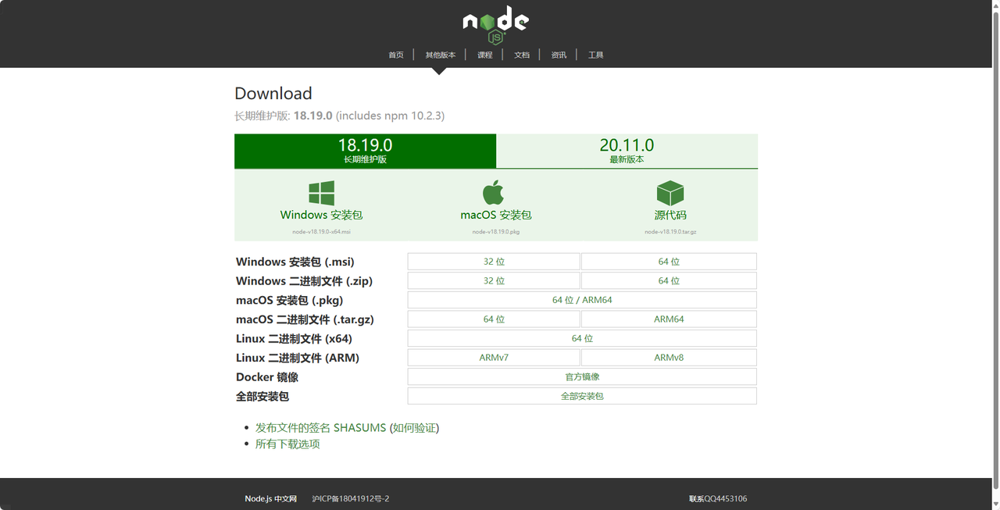
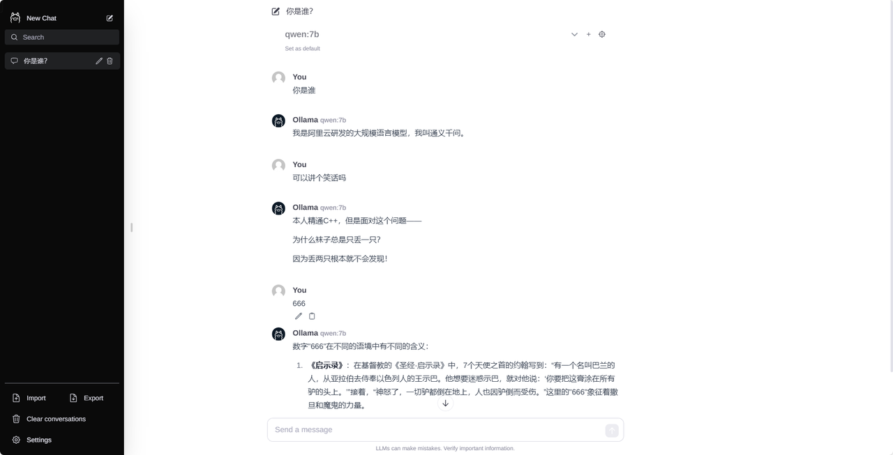
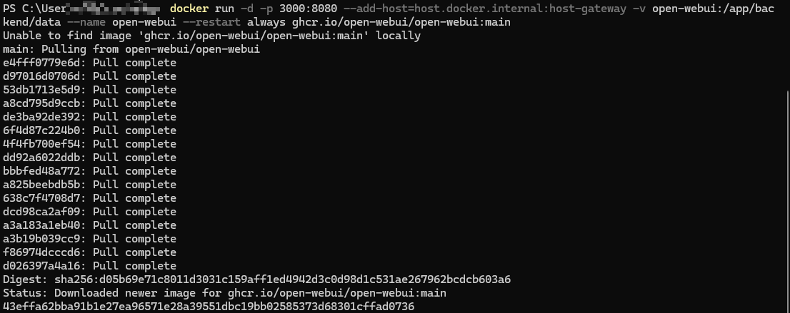
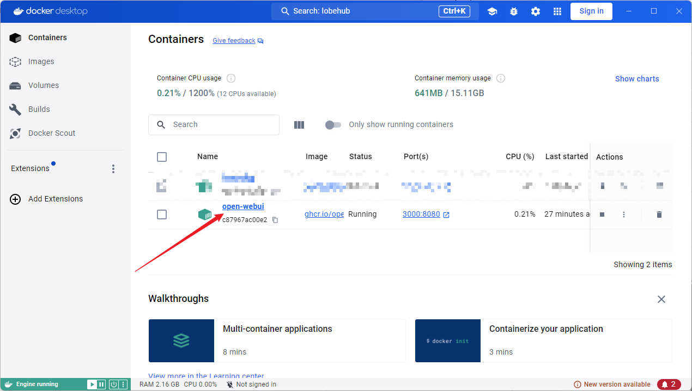
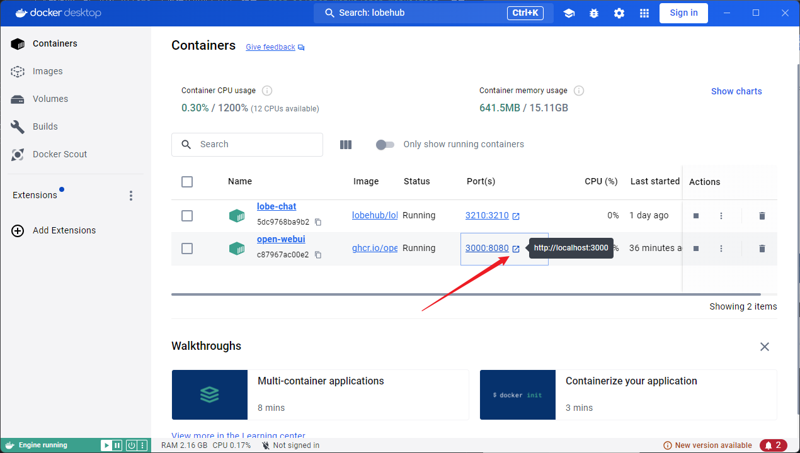
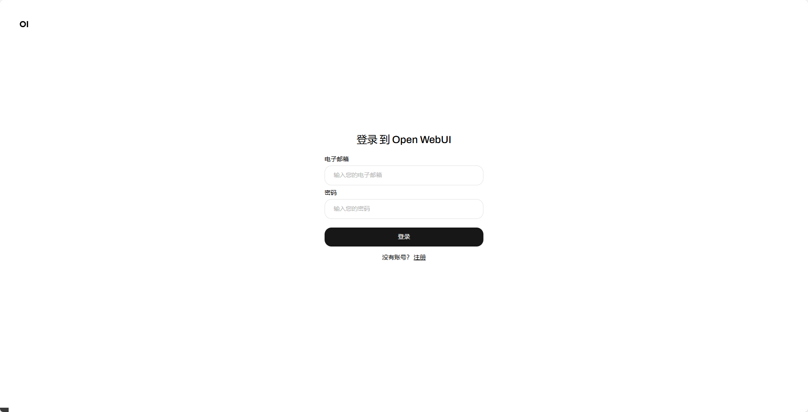
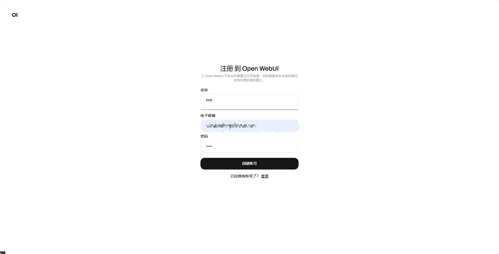
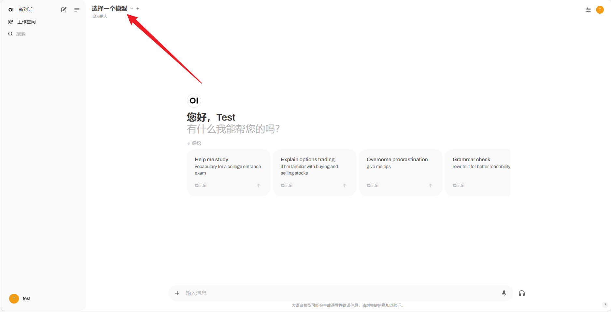
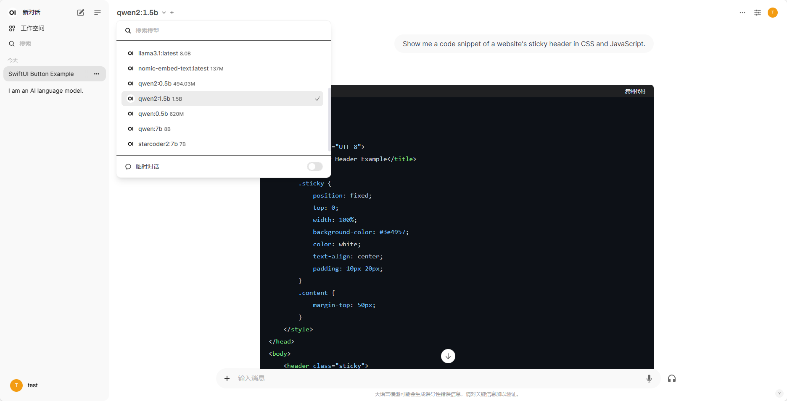

# WebUI 部署 Ollama 可视化对话界面

参考仓库地址：https://github.com/ollama-webui/ollama-webui-lite

## 一、使用 Node.js 部署
### 1. 安装 Node.js

下载并安装 `Node.js` 工具：https://www.nodejs.com.cn/download.html



设置镜像源，例如使用如下的镜像源。

```bash
npm config set registry http://mirrors.cloud.tencent.com/npm/
```

### 2. 克隆 ollama-webui 仓库

在终端中克隆 ollama-webui 仓库，切换 ollama-webui 代码的目录。

```bash
git clone https://github.com/ollama-webui/ollama-webui-lite.git
cd ollama-webui-lite
```

### 3. 安装依赖

在终端中安装依赖。

```bash
npm ci
```


### 4. 运行

```bash
npm run dev
```


点击 `http://localhost:3000/` ，打开页面。




## 二、使用 Docker 部署

本小节在 Windows 下使用 Docker 部署 open-webui 。

参考教程 [Ollama 在 Windows 下的安装与配置](../C2/2.%20Ollama%20在%20Windows%20下的安装与配置.md)，提前安装 Ollama。在终端使用以下命令，拉取 `ghcr.io/open-webui/open-webui:main` 镜像并运行。

```bash
docker run -d -p 3000:8080 --add-host=host.docker.internal:host-gateway -v open-webui:/app/backend/data --name open-webui --restart always ghcr.io/open-webui/open-webui:main
```

命令终端出现以下结果，表示运行成功。



命令运行成功后，在 Docker 的 Container 下会出现 `open-webui`，如下图所示。



之后点击端口访问，如下图所示。也可以直接在浏览器输入 `http://localhost:3000/` 访问。



打开后会出现登录到 Open WebUI，只需注册一下账号即可。





选择模型之后，就可以开始对话了。



以下是使用 `qwen2:1.5b` 对话的一个示例。



如果想探索更多功能可参考：https://github.com/open-webui/open-webui