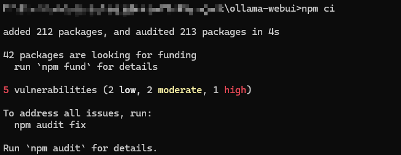
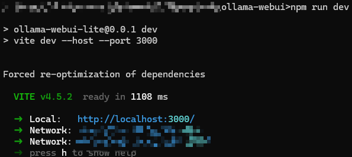

# WebUI 部署 Ollama 可视化对话界面

参考仓库地址：https://github.com/ollama-webui/ollama-webui-lite

## 一、环境准备

下载并安装 `Node.js` 工具：https://www.nodejs.com.cn/download.html


设置镜像源，例如使用如下的镜像源。

```bash
npm config set registry http://mirrors.cloud.tencent.com/npm/
```

## 二、克隆仓库

克隆 ollama-webui 仓库，切换 ollama-webui 代码的目录。

```bash
git clone https://github.com/ollama-webui/ollama-webui-lite.git
cd ollama-webui-lite
```

## 三、安装依赖

4. 安装所需依赖。

```bash
npm ci
```



## 四、启动Web页面

```bash
npm run dev
```



打开页面。

