# 搭建本地的 AI Copilot 编程助手

## 简介

本文档介绍了如何在本地搭建类似 Copilot 的编程助手，以帮助您写出更加优美，效率的代码。

从过本课程你将学会，使用 Ollama 集成本地编程助手，其中包括

- Continue
- Aider

> 注意：
>
> 1. 我们讲主要讲解 VScode 的安装和基本使用方式。jetbrain 使用方式和 VScode 大同小异，参考 vscode 即可。
> 2.  jetbrain 可以使用的功能和可配置项不如 VScode 丰富，建议使用 VScode
> 3. 本地搭建 Copilot 对机器要求较高，特别是代码自动补全部分，若无特殊需求，建议购买 API 使用。

## 一、AI 编程介绍

### 1.1 为什么我们要使用 AI 编程？

大语言模型问世已久，但是其表现最出色的领域一直是编程领域，原因如下：

1. **明确的对错标准。** 在编程世界里, 代码要么能跑, 要么不能。这种非黑即白的特性让 AI 更容易判断自己的输出质量。
2. **精确的语言。** 编程语言没有太多模棱两可的地方。每个符号、每个关键字都有明确的含义。这种精确性正是 AI 模型所擅长的。
3. **目标明确的任务。** 写代码时, 我们通常有明确的目标。比如, "写一个计算斐波那契数列的函数"。这种清晰的指令让 AI 更容易集中精力解决问题。
4. **知识的通用性。** 学会了一种编程语言的基本概念, 很多东西都能迁移到其他语言。这种知识的可迁移性让 AI 模型在编程领域学习效率特别高。

### 1.2 我们如何使用 AI 编程？

1. 使用大模型对话应用（这里不再讲解）
2. 使用集成开发环境（IDE）
   - Continue
3. 使用命令行工具
   - Aider

## 二、集成开发环境 Continue 接入

### 2.1 安装所需模型

1. 安装 Ollama
2. 安装以下模型
   - 安装通用问答模型 `ollama pull llama3:8b`
   - 安装自动代码补全模型: `ollama pull starcoder2:3b`
   - 安装 embedding 模型: `ollama pull nomic-embed-textO`

### 2.2 在 VScode 安装 Continue 以及配置本地 Ollama 

1. 在 VScode 插件库安装模型

   搜索 Continue ，看到如下的图标，点击 install 或者安装

   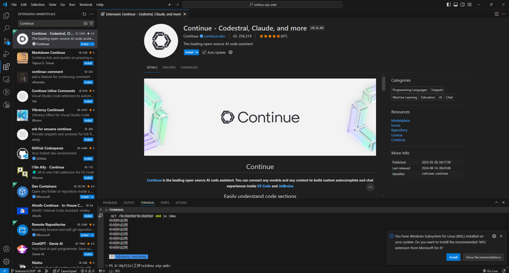

2. （推荐操作）强烈建议将"继续"移至 VS Code 的右侧边栏。这有助于在使用"继续"时保持文件资源管理器打开，并且可以使用简单的键盘快捷键切换侧边栏。

   

3. 配置 Ollama

   方式1：点击 Select model----选择 Add model----点击 Ollama----选择 Autodetect

   这样，就可以自动选择刚刚我们在 Ollama 上下载好的模型进行代码推理工具了。

   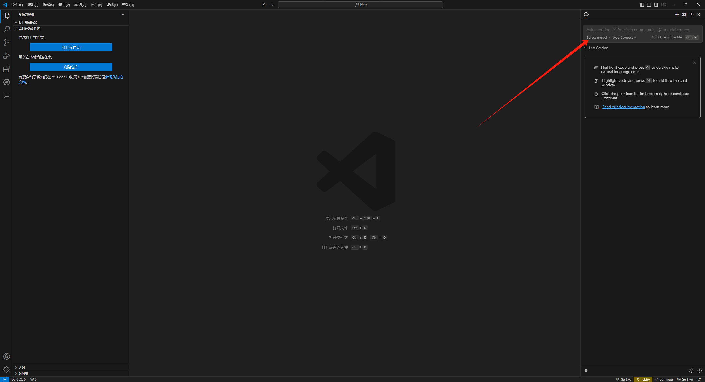

   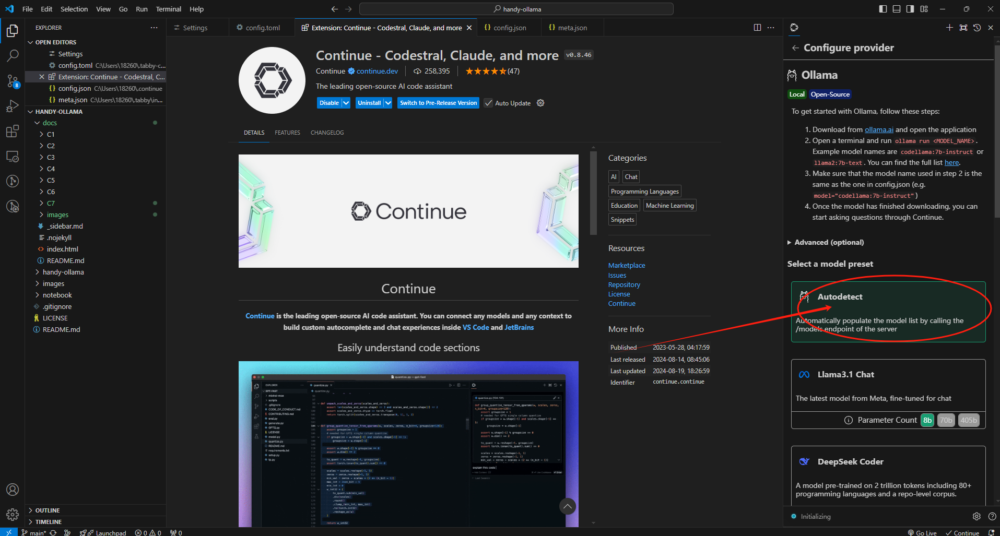

   方式2：点击如图所示的设置按钮，进入配置页面，粘贴如下配置

   ``` typescript
   {
     "models": [
       {
         "title": "Ollama",
         "provider": "ollama",
         "model": "AUTODETECT"
       }
     ],
     "tabAutocompleteModel": {
       "title": "Starcoder 2 3b",
       "provider": "ollama",
       "model": "starcoder2:3b"
     },
     "embeddingsProvider": {
       "provider": "ollama",
       "model": "nomic-embed-text"
     }
   }
   ```

   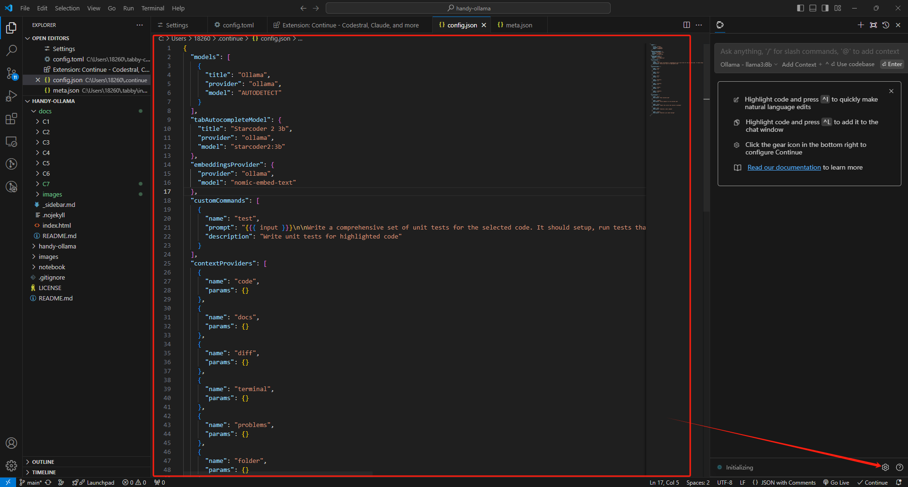

### 2.3 基本使用指南

1. **轻松理解代码**

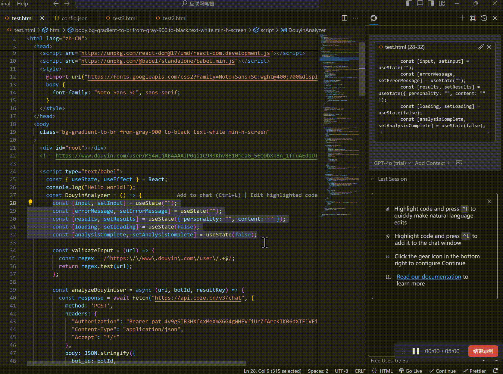

- VS Code : `cmd+L` ( MacOS ) / `ctrl+L` ( Windows )
- JetBrains : `cmd+J` ( MacOS ) / `ctrl+J` ( Windows )

2. **使用 Tab 键自动完成代码**

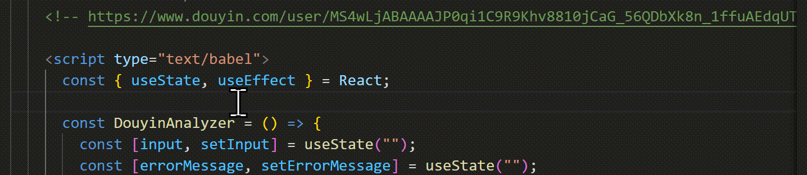

- VS Code : `tab` ( MacOS ) / `tab` ( Windows )
- JetBrains : `tab` ( MacOS ) / `tab` ( Windows )

3. **AI快速修改你的代码**

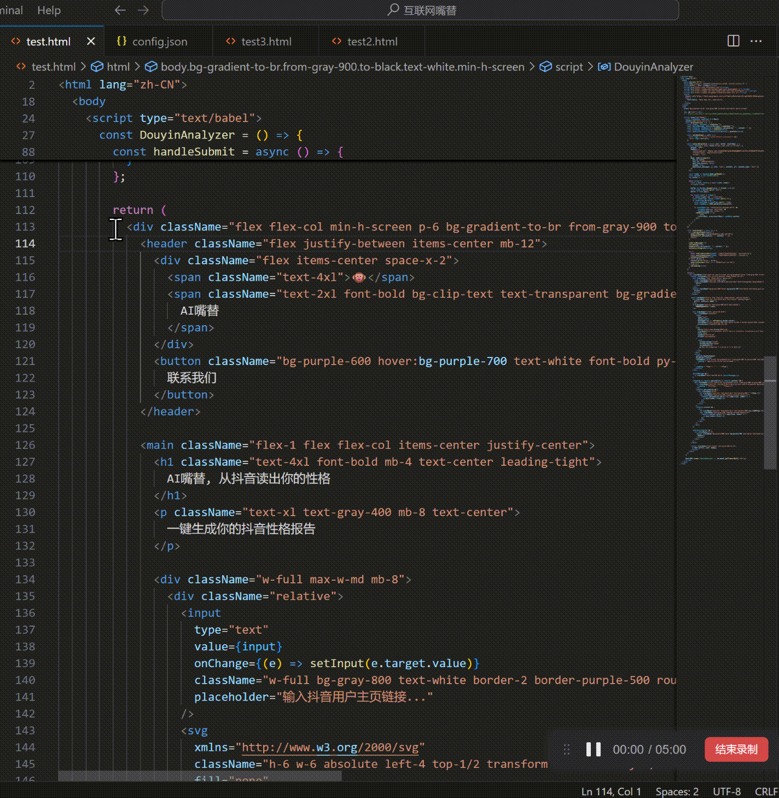

- VS Code : `cmd+I` ( MacOS ) / `ctrl+I` ( Windows )
- JetBrains : `cmd+I` ( MacOS ) / `ctrl+I` ( Windows )

3. **根据当前代码目录提问** 

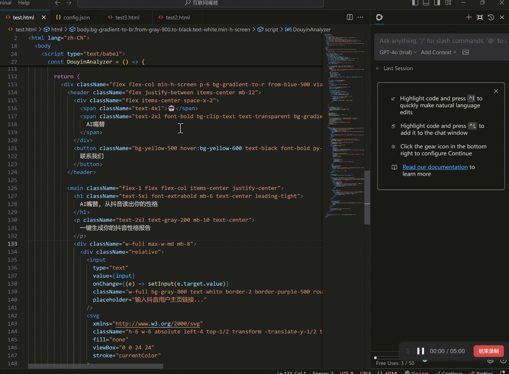

- VS Code: `@codebase` ( MacOS ) / `@codebase` ( Windows )
- JetBrains : 未来将支持

4. **根据官方文档提问** 

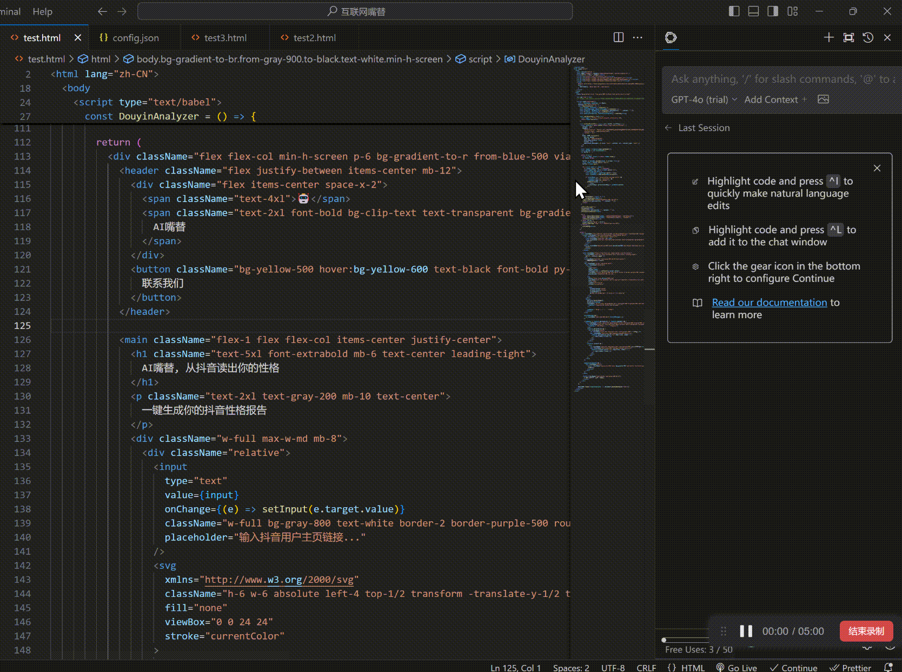

-  VS Code : `@docs` ( MacOS ) / `@docs` ( Windows )
-  JetBrains : `@docs` ( MacOS ) / `@docs` ( Windows )

### 2.4 参考资料

官方网站：https://docs.continue.dev/intro

## 三、命令行环境 Aider 接入

Aider 是基于命令行的编程助手，比起集成开发环境，它拥有顶级的系统权限和功能使用，但同时意味着它更难上手。

以下教程将教会你安装 Aider 以及连接到 Ollama 服务

此外，请确保：

1. 安装了 git 并且有 git 使用经验
2. python 使用经验

### 3.1 安装 Aider

1. Aider 的使用过程中对 python 环境有大量依赖，建议使用 conda 新开一个环境或者使用 python 新建虚拟环境，以下使用 conda 演示

   - 新起一个 conda 虚拟环境（python 虚拟环境同理）

     ``` pyth
     conda create -n aider_env python=3.9
     ```

   - 进入该虚拟环境

     ``` 
     conda activate aider_env
     ```

   - 按照以下命令安装

     ```
     python -m pip install aider-chat
     ```

### 3.2 设置 Ollama 并启动

1. 启动命令行，按照如下设置环境变量

   ``` 
   export OLLAMA_API_BASE=http://127.0.0.1:11434 # Mac/Linux环境
   setx OLLAMA_API_BASE http://127.0.0.1:11434 # Windows环境,设置以后重启shell工具
   ```

2. cd 进入自己本地的代码仓库位置，若没有，Aider 会自动在当前目录下初始化 git 仓库

   ``` 
   #example 
   cd D:\Myfile\handy-ollama\handy-ollama\handy-ollama
   ```

3. 使用以下命令运行 Aider

   ``` powershell
   aider --model ollama/<你的模型名字>
   #example
   #aider --model ollama/llama3:8b
   ```

   你也可以使用 .env 文件配置 Aider 相关信息

   比如

   ``` 
   ## 指定OPENAI_KEY(如果有的话)
   OPENAI_API_KEY=xxx
   
   ## 指定你使用model
   AIDER_MODEL=ollama/llama3:8b
   ```

   更多配置参考：https://aider.chat/docs/config/dotenv.html

4. 进入以下页面即成功

   

5. 你现在可以跟他聊天，或者给他发送一些指令，它可以直接修改你的代码

   

### 3.3 基本使用

1. 你可以问它一些关于这个仓库的基本信息

   

2. Add Files 添加文件

   ``` 
   /add <file1> <file2> ...
   ```

   然后你就可以根据这些文件来做一些提问

   - 你可以在不添加任何文件的情况下使用 Aider，它会根据您的请求尝试找出需要编辑哪些文件。(但是想过往往不好)
   - 添加相关的文件以对某个特定的代码或者文件进行修改或者答疑。（不要添加一堆额外的文件。如果添加太多文件，生成效果也不好，并且需要花费更多 Token ）。 

   示例：

   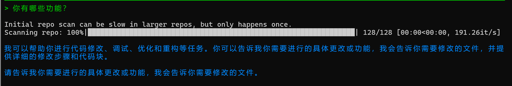

   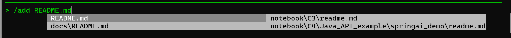

   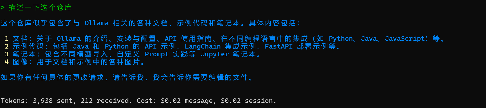

3. 使用 Aider 直接对代码文件或者其他文件进行修改，比如对 Readme最后一行加一个总结

   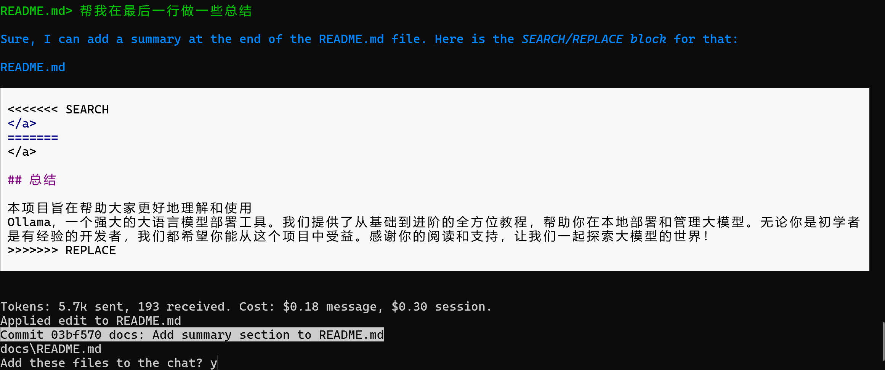

   查看实际文件

   

4. 如果不希望 Aider 对文件进行实际操作，可以在对话前添加操作符 /ask

5. 使用 /drop 删除所有添加入的文件

### 3.4 参考资料

常用斜杠命令列表：

| 命令           | 描述                                                         |
| -------------- | ------------------------------------------------------------ |
| `/add`         | 将文件添加到聊天中，以便 GPT 可以编辑或详细审查它们          |
| `/ask`         | 询问关于代码库的问题，而不编辑任何文件                       |
| `/chat-mode`   | 切换到新的聊天模式                                           |
| `/clear`       | 清除聊天历史                                                 |
| `/clipboard`   | 将剪贴板中的图像/文本添加到聊天中（可选择为图像提供名称）    |
| `/code`        | 请求对代码进行更改                                           |
| `/commit`      | 提交在聊天外对仓库所做的编辑（提交信息可选）                 |
| `/diff`        | 显示自上次消息以来的更改差异                                 |
| `/drop`        | 从聊天会话中移除文件以释放上下文空间                         |
| `/exit`        | 退出应用程序                                                 |
| `/git`         | 运行 git 命令                                                |
| `/help`        | 询问关于 aider 的问题                                        |
| `/lint`        | 对提供的文件或聊天中的文件进行代码检查和修复（如果未提供文件） |
| `/ls`          | 列出所有已知文件，并指示哪些文件包含在聊天会话中             |
| `/map`         | 打印当前仓库信息                                             |
| `/map-refresh` | 强制刷新仓库信息并打印出来                                   |
| `/model`       | 切换到新的语言模型                                           |
| `/models`      | 搜索可用模型列表                                             |
| `/quit`        | 退出应用程序                                                 |
| `/read-only`   | 将文件添加到聊天中，仅供参考，不可编辑                       |
| `/run`         | 运行 shell 命令，并可选择将输出添加到聊天中（别名：!）       |
| `/test`        | 运行 shell 命令，并在非零退出代码时将输出添加到聊天中        |
| `/tokens`      | 报告当前聊天上下文使用的令牌数量                             |
| `/undo`        | 如果最后一次 git 提交是由 aider 完成的，则撤销该提交         |
| `/voice`       | 录制并转录语音输入                                           |
| `/web`         | 抓取网页，转换为 markdown 并添加到聊天中                     |

更多用法请参照 https://aider.chat/docs/usage.html

## 四、集成开发环境 RooCline 接入（新）

### 4.1 Cline 和 RooCline

Cline是目前世界范围内最火热的 vscode 的 ai 编程插件。它对人工智能辅助的运用方式与市场上大多数工具不同。它并非仅仅专注于代码生成或补全，而是作为一种系统级工具运行，能够与整个开发环境进行交互。在处理复杂的调试场景、大规模重构或集成测试时，这一特性就显得尤为重要，具体我们可以看参考资料中的Cline部分。今天我们要介绍的是 Roo Cline。

RooCline 是 Cline 的增强版，专注于提升开发效率和灵活性。它支持多语言、多模型（如 Gemini、Meta 等），并提供了智能通知、文件处理优化、缺失代码检测等功能。此外，RooCline 还支持与 Cline 并行运行，适合需要同时处理多种任务的开发者。

虽然 Roo Cline 的量级仍然不及 Cline，但增速很快。它在 Cline 的基础上，加了一些额外的实验功能，还能自我编写部分代码，只需要人类做少量干预。

并且 Cline 消耗的 Token 数量很高，这或多或少影响了日常开发成本。


### 4.1 在 VScode 安装 RooCline 以及配置本地 Ollama

1. Ollama 安装模型（以 deepseek-r1:1.5b 为例）

   ``` cmd
   ollama run deepseek-r1:1.5b
   ```

2. 在 VScode 插件库安装模型

   搜索 Roo Cline ，看到如下的图标，点击 install 或者安装

   

3. 配置 ollama

   1. 点击右边 Roo cline 图标
   2. 点击设置图标
   3. 输入模型名称
   4. 点击 Done 

   

4. 现在，你可以像使用其他任何集成编辑器+ ai 一样使用 vscode

   

接下来，我们会介绍一些 Roo cline 独有的功能！

### 4.2  Roo Cline 特性

注意，这些特性需要依赖一定的大模型能力，特别是在控制系统级别应用的时候。我们举例中的 deepseek-r1:1.5b 不具备一下这些操作的能力，会报错复杂度太高。建议接入 deepseek 的 api 访问（很便宜）。

以下1~2功能点击功能区域的 Prompt 图标即可进入配置页面


1. 支持任意 API/模型

   - OpenRouter/Anthropic/Glama/OpenAI/Google Gemini/AWS Bedrock/Azure/GCP Vertex

   - 本地模型（LM Studio/Ollama）及任何 OpenAI 兼容接口

   - 不同模式可使用不同模型（如架构设计用高级模型，日常编码用经济模型）

   - 会话级使用量追踪（Token 消耗和成本统计）

2. 自定义模式：通过模式定制 Roo Code 的角色、指令和权限：

   - 内置模式
     - **Code** 模式：默认多功能编码助手
     - **Architect** 模式：系统级设计和架构分析
     - **Ask** 模式：深度研究及问题解答

   - 用户创建模式
     - 输入"Create a new mode for <X>"即可生成定制角色
     - 每个模式可拥有独立指令和技能集（在 Prompts 标签管理）

   - 高级功能
     - 文件类型限制（如 ask/architect 模式仅编辑 markdown）
     - 自定义文件规则（如仅操作 .test.ts 测试文件）
     - 模式间切换（如自动转代码模式实现具体功能）
     - 自主创建新模式（含角色定义和文件限制）

3. 颗粒度控制 Roo cline 权限

   点击设置界面进入：可以在 Auto-Approve Setting 控制 Roo cline 的权限.

   注意，这里控制的是哪些操作可以不经过你的同意自动进行。否则将会在进行前对你进行一次点击确认过程

   

4. 文件与编辑器操作

   - 项目文件创建/编辑（显示差异对比）

   - 自动响应代码错误（缺失导入、语法问题等）

   - 通过编辑器时间轴追踪变更（便于审查/回滚）


5. 命令行集成

   - 包管理/构建/测试命令

   - 监控输出并自动适配错误

   - 后台持续运行开发服务器
   支持审批策略：逐条确认/常规操作自动批准


6. 浏览器自动化

   在第三步中，选择以下选项即可让 Roo Cline拥有网页自动化能力

   

   - 启动本地/远程 Web 应用

   - 点击/输入/滚动/截图操作

   - 收集控制台日志调试运行时问题
   适用于端到端测试和视觉验证


7. MCP 工具扩展

   Model Context Protocol (MCP) 是 Roo 的能力扩展协议，允许 Roo 与本地服务器通信，这些服务器提供额外的工具和资源。相当于给这个编程助手装上了"外接大脑"。

   本地/云端双模式：既可以用你电脑本地的工具服务，也能连社区共享的现成模块

   动态创建工具：直接告诉 Roo "做个能查最新 npm 文档的工具"，它会自动生成对接代码

   举例：

   1. 接社区资源：用别人造好的轮子

      比如接入已存在的「天气 API 查询工具」

      直接使用开源社区验证过的工具

   2. 自建私藏工具：根据业务需求定制

      说"做个能抓取公司内部日志的工具"

      Roo 会自动生成：

      ```python
      # 示例自动生成的工具框架
      class LogTool(MCPPlugin):
          def fetch_logs(self, service_name):
          # 自动对接公司日志系统
          # 返回最近1小时的关键错误日志
      ...
      ```

      你审核通过后，这个工具就会出现在 Roo 的技能列表里

   3. 安全机制：所有新增工具需要人工审核授权才会激活，防止随意调用敏感接口

   

8. 上下文@：提供额外上下文的方式：

   - `@file`：嵌入文件内容

   - `@folder`：包含完整目录结构

   - `@problems`：引入工作区错误/警告

   - `@url`：获取 URL 文档（转 markdown）

   - `@git`：提供 Git 提交记录/差异分析
   帮助聚焦关键信息，优化 token 使用

### 4.3 参考资料（推荐阅读）

Roo Cline github地址：https://github.com/RooVetGit/Roo-Code 现已改名叫 Roo-Code，更多新功能等你去发现

Cline 介绍：https://zhuanlan.zhihu.com/p/21779725904

Cline 和 Cursor 对比：https://aicoding.csdn.net/679052f1911edf5f3b049d25.html

使用 ai 编程工具从零不写一行代码完成一个AI服务网站：https://cloud.tencent.com/developer/article/2479975

