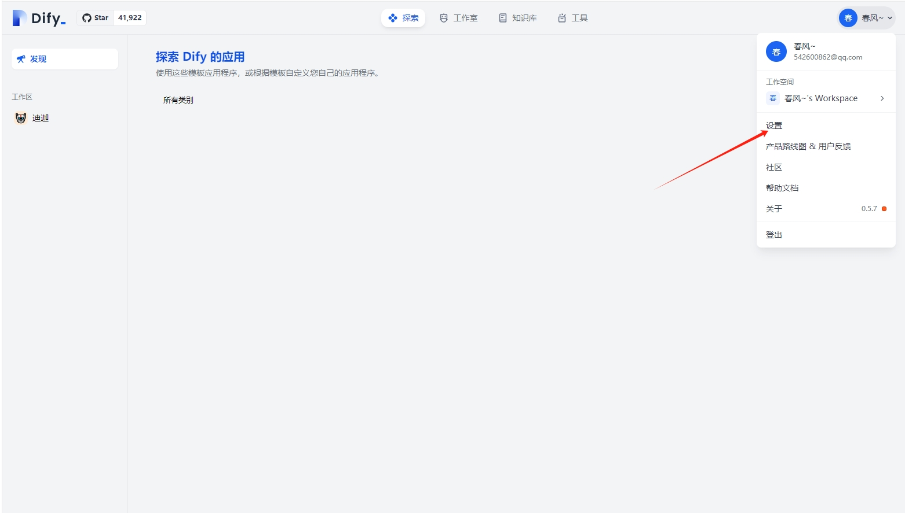
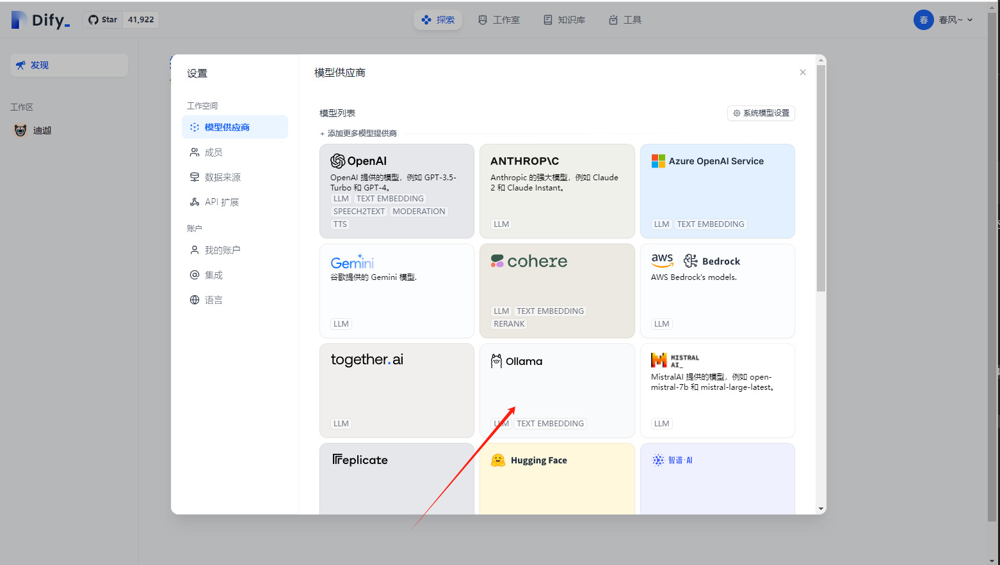
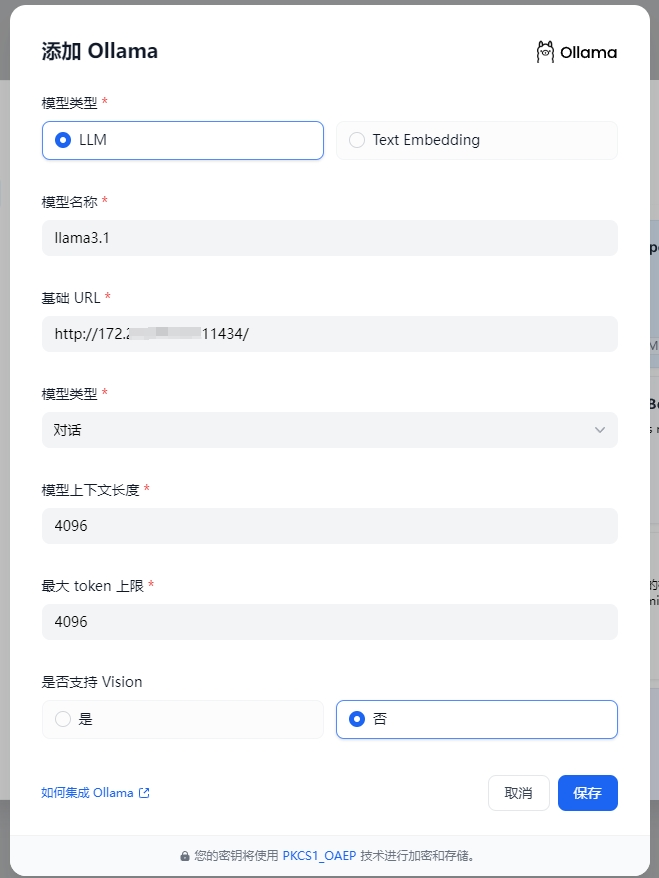
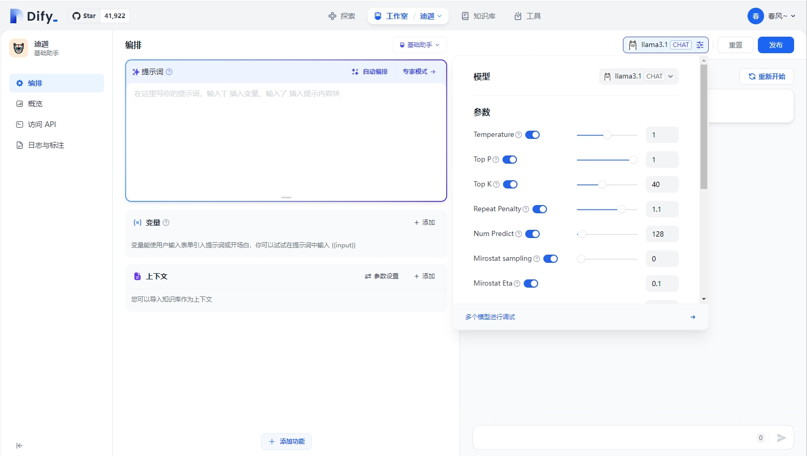

# Dify 接入 Ollama 部署的本地模型

Dify 支持接入 Ollama 部署的大型语言模型推理和 embedding 能力。

## 快速接入


1. 下载 Ollama

   访问 [Ollama 安装与配置](../C2)，查看 Ollama 本地部署教程。

2. 运行 Ollama 并与 Llama 聊天

    ```bash
    ollama run llama3.1
    ```

    启动成功后，ollama 在本地 11434 端口启动了一个 API 服务，可通过 `http://localhost:11434` 访问。

    其他模型可访问 [Ollama Models](https://ollama.ai/library) 了解详情。

3. 在 Dify 中接入 Ollama

   在 `设置 > 模型供应商 > Ollama` 中填入：

   
   
   

   - 模型名称：`llama3.1`
   
   - 基础 URL ：`http://<your-ollama-endpoint-domain>:11434`
   
     此处需填写可访问到的 Ollama 服务地址。
   
     若 Dify 为 docker 部署，建议填写局域网 IP 地址，如：`http://192.168.1.100:11434` 或 docker 宿主机 IP 地址，如：`http://172.17.0.1:11434`。
      > 注：查找局域网 IP 地址命令：
      >  - 在 Linux/macOS 上，使用命令 `ip addr show` 或 `ifconfig`。
      >  - 在 Windows 上，使用 `ipconfig` 命令查找类似的地址。
      >  - 通常，这个地址会在 eth0 或 wlan0 接口下显示，取决于你是使用有线网络还是无线网络。     
   
     若为本地源码部署，可填写 `http://localhost:11434`。

   - 模型类型：`对话`

   - 模型上下文长度：`4096`
   
     模型的最大上下文长度，若不清楚可填写默认值 4096。
   
   - 最大 token 上限：`4096`
   
     模型返回内容的最大 token 数量，若模型无特别说明，则可与模型上下文长度保持一致。

   - 是否支持 Vision：`是`
   
     当模型支持图片理解（多模态）勾选此项，如 `llava`。

   点击 "保存" 校验无误后即可在应用中使用该模型。

   Embedding 模型接入方式与 LLM 类似，只需将模型类型改为 Text Embedding 即可。

5. 使用 Ollama 模型

   

   进入需要配置的 App 提示词编排页面，选择 Ollama 供应商下的 `llama3.1` 模型，配置模型参数后即可使用。

## FAQ

### ⚠️ 如果您使用 Docker 部署 Dify 和 Ollama ，您可能会遇到以下错误:

```
httpconnectionpool(host=127.0.0.1, port=11434): max retries exceeded with url:/cpi/chat (Caused by NewConnectionError('<urllib3.connection.HTTPConnection object at 0x7f8562812c20>: fail to establish a new connection:[Errno 111] Connection refused'))

httpconnectionpool(host=localhost, port=11434): max retries exceeded with url:/cpi/chat (Caused by NewConnectionError('<urllib3.connection.HTTPConnection object at 0x7f8562812c20>: fail to establish a new connection:[Errno 111] Connection refused'))
```

这个错误是因为 Docker 容器无法访问 Ollama 服务。 localhost 通常指的是容器本身，而不是主机或其他容器。要解决此问题，您需要将 Ollama 服务暴露给网络。

### 在 Mac 上设置环境变量

如果 `Ollama` 作为 `macOS` 应用程序运行，则应使用以下命令设置环境变量`launchctl` ：

1. 通过调用 `launchctl setenv` 设置环境变量：

    ```bash
    launchctl setenv OLLAMA_HOST "0.0.0.0"
    ```

2. 重启 Ollama 应用程序。

3. 如果以上步骤无效，可以使用以下方法：

    问题是在 docker 内部，你应该连接到 `host.docker.internal` ，才能访问 docker 的主机，所以将 `localhost` 替换为 `host.docker.internal` 服务就可以生效了：

    ```bash
    http://host.docker.internal:11434
    ```

### 在 Linux 上设置环境变量

如果 Ollama 作为 systemd 服务运行，应该使用 `systemctl` 设置环境变量：

1. 通过调用 `systemctl edit ollama.service` 编辑 systemd 服务。这将打开一个编辑器。

2. 对于每个环境变量，在 `[Service]` 部分下添加一行 `Environment` ：

    ```ini
    [Service]
    Environment="OLLAMA_HOST=0.0.0.0"
    ```

3. 保存并退出。

4. 重载 `systemd` 并重启 Ollama：

   ```bash
   systemctl daemon-reload
   systemctl restart ollama
   ```

### 在 Windows 上设置环境变量

在 Windows 上， Ollama 继承了您的用户和系统环境变量。

1. 首先通过任务栏点击 Ollama 退出程序

2. 从控制面板编辑系统环境变量

3. 为您的用户账户编辑或新建变量，比如 `OLLAMA_HOST` 、 `OLLAMA_MODELS` 等。

4. 点击 OK/Apply 应用保存

5. 在一个新的终端窗口运行 `ollama`

### 如何在我的网络上暴露 Ollama？

 Ollama 默认绑定127.0.0.1端口11434。通过 `OLLAMA_HOST` 环境变量更改绑定地址。

> 参考文档
- [dify](https://docs.dify.ai/)


