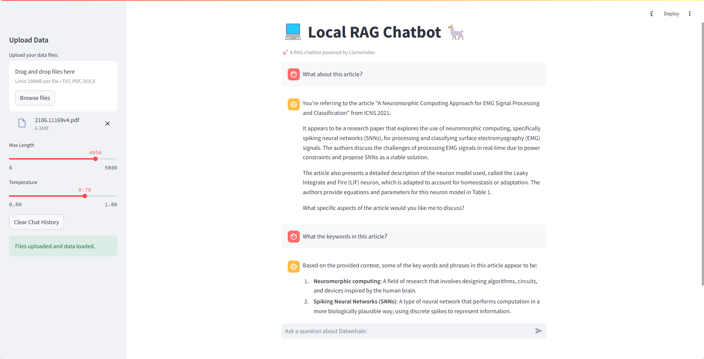

# 使用 LlamaIndex 搭建本地 RAG 应用

## 简介

本文档将详细介绍如何使用 LlamaIndex 框架来搭建本地 RAG（Retrieval-Augmented Generation）应用。通过集成 LlamaIndex，可以在本地环境中构建一个 RAG 系统，结合检索与生成的能力，以提高信息检索的效率和生成内容的相关性。可以自定义本地知识库路径，通过 LlamaIndex 构建索引，然后利用索引进行上下文对话。

>注: 本文档包含核心代码片段和详细解释。完整代码可见 [notebook](../../notebook/C7/LlamaIndex_RAG/使用LlamaIndex搭建本地RAG应用.ipynb) 。

## 1. 模型下载

本例中使用的是 `llama3.1` 模型，可以根据自身电脑配置，使用合适的模型。

```bash
ollama pull llama3.1
ollama pull nomic-embed-text
```

## 2. 安装依赖

```bash
pip install llama-index-llms-ollama
pip install llama-index-embeddings-ollama
pip install -U llama-index-readers-file
```

## 3. 加载数据

加载当前目录下 data 文件夹中所有的文档，并加载到内存中。

```python
documents = SimpleDirectoryReader("data").load_data()
```

## 4. 构建索引

```python
Settings.embed_model = OllamaEmbedding(model_name="nomic-embed-text")

Settings.llm = Ollama(model="llama3.1", request_timeout=360.0)

index = VectorStoreIndex.from_documents(
    documents,
)
```

- `Settings.embed_model` ： 全局的 `embed_model` 属性。示例代码中将创建好的嵌入模型赋值给全局的 `embed_model` 属性；
- `Settings.llm` ： 全局的 `llm` 属性。示例代码中将创建好的语言模型赋值给全局的 `llm` 属性；
- `VectorStoreIndex.from_documents`：使用之前加载的文档构建索引，并转换成向量，便于快速检索。

通过 `Settings` 全局属性的设置，在后面的索引构建以及查询的过程中就会默认使用相应的模型。


## 5. 查询数据

```python
query_engine = index.as_query_engine()
response = query_engine.query("Datawhale是什么?")
print(response)
```

- `index.as_query_engine()`：根据之前构建好的索引，创建查询引擎。该查询引擎可以接收查询，返回检索后的响应。


## 6. 检索上下文进行对话

由于检索到的上下文可能会占用大量可用的 LLM 上下文，因此需要为聊天历史记录配置较小 token 限制！

```python
# 检索上下文进行对话
from llama_index.core.memory import ChatMemoryBuffer
memory = ChatMemoryBuffer.from_defaults(token_limit=1500)

chat_engine = index.as_chat_engine(
    chat_mode="context",
    memory=memory,
    system_prompt=(
        "You are a chatbot, able to have normal interactions."
    ),
)

response = chat_engine.chat("Datawhale是什么？")
print(response)
```

`chat_mode` 可以根据使用场景，选择合适的模式，支持的模式如下：

- `best`（默认）：使用带有查询引擎工具的代理（react 或 openai）；
- `context`：使用检索器获取上下文；
- `condense_question`：将问题进行浓缩；
- `condense_plus_context`：将问题进行浓缩并使用检索器获取上下文；
- `simple`：直接使用 LLM 的简单聊天引擎；
- `react`：使用带有查询引擎工具的 react 代理；
- `openai`：使用带有查询引擎工具的 openai 代理。

## 7. 向量索引的存储和加载

- `storage_context.persist` 存储向量索引。
- `load_index_from_storage` 加载向量索引。

```python
# 存储向量索引
persist_dir = 'data/'
index.storage_context.persist(persist_dir=persist_dir)

# 加载向量索引
from llama_index.core import StorageContext, load_index_from_storage
storage_context = StorageContext.from_defaults(persist_dir=persist_dir)
index= load_index_from_storage(storage_context)
```

## 8. streamlit 应用

本例内容还实现了一个 streamlit 应用，具体可以查看 [app.py]()

所需依赖如下：

```bash
llama_index==0.10.62
streamlit==1.36.0
```

> [!NOTE]  
> 在 `app.py` 中，为了在连续对话中不重新加载模型，可以配置环境变量 `OLLAMA_NUM_PARALLEL` 和 `OLLAMA_MAX_LOADED_MODELS`，因为支持多个模型加载，所以至少需要额外的 8G 内存。
> 
> `OLLAMA_NUM_PARALLEL`：同时处理单个模型的多个请求。
> 
> `OLLAMA_MAX_LOADED_MODELS`：同时加载多个模型。

示例展示

1. 单文本问答



2. 多文本问答


参考文献

- [LlamaIndex 文档](  https://docs.llamaindex.ai/en/stable/getting_started/starter_example_local/?h=ollama#load-data-and-build-an-index)