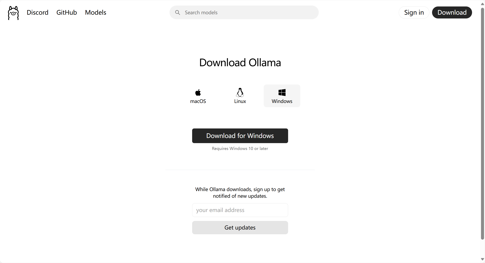

# 使用 DeepSeek R1 和 Ollama 实现本地 RAG 应用

## 简介

本文档详细介绍如何利用 DeepSeek R1 和 Ollama 构建本地化的 RAG（检索增强生成）应用。同时也是对 [使用 LangChain 搭建本地 RAG 应用](3.%20使用%20LangChain%20搭建本地%20RAG%20应用.md) 的补充。

我们将通过实例演示完整的实现流程，包括文档处理、向量存储、模型调用等关键步骤。本教程选用 DeepSeek-R1 1.5B 作为基础语言模型。考虑到不同模型具有各自的特点和性能表现，读者可以根据实际需求选择其他合适的模型来实现 RAG 系统。

>注: 本文档包含核心代码片段和详细解释。完整代码可见 [notebook](https://github.com/datawhalechina/handy-ollama/blob/main/notebook/C7/DeepSeek_R1_RAG/%E4%BD%BF%E7%94%A8%20DeepSeek%20R1%20%E5%92%8C%20Ollama%20%E5%AE%9E%E7%8E%B0%E6%9C%AC%E5%9C%B0%20RAG%20%E5%BA%94%E7%94%A8.ipynb) 。

## 1. 文档加载

加载 PDF 文档并将其切分为适当大小的文本块。

```python
from langchain_community.document_loaders import PDFPlumberLoader

file = "DeepSeek_R1.pdf"

# Load the PDF
loader = PDFPlumberLoader(file)
docs = loader.load()

from langchain.text_splitter import RecursiveCharacterTextSplitter
text_splitter = RecursiveCharacterTextSplitter(chunk_size=500, chunk_overlap=0)
all_splits = text_splitter.split_documents(docs)
```

## 2. 初始化向量存储

使用 Chroma 数据库存储文档向量，并配置 Ollama 提供的嵌入模型。

```python
from langchain_chroma import Chroma
from langchain_ollama import OllamaEmbeddings

local_embeddings = OllamaEmbeddings(model="nomic-embed-text")

vectorstore = Chroma.from_documents(documents=all_splits, embedding=local_embeddings)
```

## 3. 构建 Chain 表达式

设置模型和提示模板，构建处理链。

```python
from langchain_core.output_parsers import StrOutputParser
from langchain_core.prompts import ChatPromptTemplate
from langchain_ollama import ChatOllama

model = ChatOllama(
    model="deepseek-r1:1.5b",
)

prompt = ChatPromptTemplate.from_template(
    "Summarize the main themes in these retrieved docs: {docs}"
)

# 将传入的文档转换成字符串的形式
def format_docs(docs):
    return "\n\n".join(doc.page_content for doc in docs)


chain = {"docs": format_docs} | prompt | model | StrOutputParser()

question = "What is the purpose of the DeepSeek project?"

docs = vectorstore.similarity_search(question)

chain.invoke(docs)
```

## 4. 带有检索的 QA

整合检索和问答功能。

```python
from langchain_core.runnables import RunnablePassthrough

RAG_TEMPLATE = """
You are an assistant for question-answering tasks. Use the following pieces of retrieved context to answer the question. If you don't know the answer, just say that you don't know. Use three sentences maximum and keep the answer concise.

<context>
{context}
</context>

Answer the following question:

{question}"""

rag_prompt = ChatPromptTemplate.from_template(RAG_TEMPLATE)

retriever = vectorstore.as_retriever()

qa_chain = (
    {"context": retriever | format_docs, "question": RunnablePassthrough()}
    | rag_prompt
    | model
    | StrOutputParser()
)

question = "What is the purpose of the DeepSeek project?"

# Run
qa_chain.invoke(question)
```

## 总结

本教程详细介绍了如何使用 DeepSeek R1 和 Ollama 构建本地化的 RAG 应用系统。我们通过四个主要步骤实现了完整的功能：

1. **文档处理**：使用 PDFPlumberLoader 加载 PDF 文档，并通过 RecursiveCharacterTextSplitter 将文本切分成适当大小的块。

2. **向量存储**：利用 Chroma 数据库和 Ollama 的嵌入模型建立向量存储系统，为后续的相似度检索提供基础。

3. **Chain 构建**：设计并实现处理链，将文档处理、提示模板和模型响应整合成流程化的处理过程。

4. **RAG 实现**：通过整合检索和问答功能，实现了完整的检索增强生成系统，能够基于文档内容回答用户问询。

通过本教程，可以快速搭建起自己的本地 RAG 系统，并根据实际需求进行定制化改进。建议在实践中多尝试不同的模型和参数配置，以获得最佳的使用效果。

>注: 使用 streamlit 或 FastAPI 等工具，可以将本地 RAG 应用部署为 Web 服务，实现更广泛的应用场景。
>
>仓库中也提供了 [`app.py`](https://github.com/datawhalechina/handy-ollama/blob/main/notebook/C7/DeepSeek_R1_RAG/app.py) 文件，可以直接运行该文件，启动 Web 服务。 参考文档 [Build a RAG System with DeepSeek R1 & Ollama](https://apidog.com/blog/rag-deepseek-r1-ollama/)。
> 注意：运行该代码前，要提前运行 Ollama 服务。

对话页面如下：

