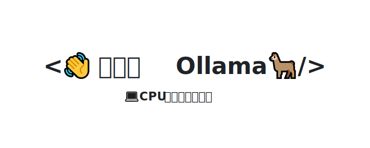

    
    <h1>💻 handy-ollama 🦙</h1>

  
  
  
    

  <h3>📚 从零开始实现 CPU 玩转大模型部署！</h3>
  
<em>动手学 Ollama，快速实现大模型本地部署</em>

简体中文 | [English](README_en.md) 

## 🎉官方收录

**2025.11.06，本项目被 Ollama 官方仓库收录，且是目前唯一的 Tutorial：https://github.com/ollama/ollama#tutorial**

## 🚀 项目简介
动手学 Ollama 教程，轻松上手实现大模型本地化部署，快速在本地管理以及运行大模型，让 CPU 也可以玩转大模型推理部署！

本教程涵盖从基础入门到进阶使用的全方位内容，并通过实际应用案例深入理解和掌握大模型部署以及应用技术。我们的教程提供清晰的步骤和实用的技巧，无论是刚刚接触大模型部署的小白，还是有一定经验的开发者，都可以从零开始学习 Ollama ，实现本地部署大模型以及相关应用。

本项目主要内容：

1. Ollama 介绍、安装和配置，包括在 macOS、Windows、Linux 和 Docker 下的安装与配置；
2. Ollama 自定义导入模型，包括从 GGUF 导入、从 Pytorch 或 Safetensors 导入、由模型直接导入、自定义 Prompt；
3. Ollama REST API，包括 Ollama API 使用指南、在 Python、Java、JavaScript 和 C++ 等语言中使用 Ollama API；
4. Ollama 在 LangChain 中的使用，包括在 Python 和 JavaScript 中的集成；
5. Ollama 可视化界面部署和应用案例，包括使用 FastAPI 和 WebUI 部署可视化对话界面，以及本地 RAG 应用、Agent 应用等。

**热忱欢迎感兴趣的同学或者开发者们 提出 issue 或者 提交 pull request，让我们一起完善这个项目！**

**我们坚信：每一位对大模型充满热情的学习者，都应该有机会探索和实践。无论你的编程语言背景如何，无论你的计算资源如何，我们都希望能帮助你使用个人 PC 实现大模型部署。 让我们携手打破技术壁垒，共同开启 LLM 探索之旅！**

目录结构说明：

      docs ---------------------- Markdown 文档文件
      notebook ------------------ Notebook 源代码文件以及部分 Python、Java 和 JavaScript 源文件 
      images -------------------- 图片

📖 在线阅读：https://datawhalechina.github.io/handy-ollama/

## 💡 立项理由
随着大模型的飞速发展，市面上出现了越来越多的开源大模型，但是许多模型的部署需要利用 GPU 资源，如何让大模型时代的红利普惠到每一个人，让每一个人都可以部署属于自己的大模型。Ollama 是一个开源的大语言部署服务工具，只需 CPU 即可部署大模型。我们希望通过动手学 Ollama 这一开源教程，帮助学习者快速上手 Ollama ，让每一位大模型爱好者、学习者以及开发者都能在本地部署自己的大模型，进而开发一些大模型应用，让大模型赋能千行百业！

## 🎯 项目受众
- 希望不受 GPU 资源限制，在本地运行大模型；
- 希望在消费级硬件上进行大模型有效的推理；
- 希望在本地部署大模型，开发大模型应用；
- 希望在本地管理大模型，让本地模型安全可靠。

## ✨ 项目亮点
本项目旨在使用 CPU 部署本地大模型，虽然目前已经有很多 LLM 相关的教程，但是这些教程中模型基本上都需要 GPU 资源，这对于很多资源受限的学习者不是很友好。因此，本项目通过动手学 Ollama ，帮助学习者快速上手本地 CPU 部署大模型。

## 📖 项目规划
### 目录（持续更新中...）
- [x] 1 [Ollama 介绍](docs/C1/1.%20Ollama%20介绍.md) @[Youdon](https://github.com/AXYZdong)
- [x] 2 Ollama 安装与配置 
  - [x] [macOS](docs/C2/1.%20Ollama%20在%20macOS%20下的安装与配置.md) @[天奥](https://github.com/lta155)
  - [x] [Windows](docs/C2/2.%20Ollama%20在%20Windows%20下的安装与配置.md) @[Yuki](https://github.com/fuyueagain)
  - [x] [Linux](docs/C2/3.%20Ollama%20在%20Linux%20下的安装与配置.md) @[Yuki](https://github.com/fuyueagain)
  - [x] [Docker](docs/C2/4.%20Ollama%20在%20Docker%20下的安装与配置.md) @[Yuki](https://github.com/fuyueagain)
- [x] 3 自定义使用 Ollama
  - [x] [自定义导入模型](docs/C3/1.%20自定义导入模型.md) @[杨卓](https://github.com/little1d)
  - [x] [自定义模型存储位置](docs/C3/2.%20自定义模型存储位置.md) @[Yuki](https://github.com/fuyueagain) @[林通](https://github.com/kjlintong) @[天奥](https://github.com/lta155)
  - [x] [自定义在 GPU 中运行](docs/C3/3.%20自定义在%20GPU%20中运行.md) @[Youdon](https://github.com/AXYZdong)
- [x] 4 Ollama REST API
  - [x] [Ollama API 使用指南](docs/C4/1.%20Ollama%20API%20使用指南.md) @[林通](https://github.com/kjlintong) @[春阳](https://github.com/Springff)
  - [x] [在 Python 中使用 Ollama API](docs/C4/2.%20在%20Python%20中使用%20Ollama%20API.md) @[春阳](https://github.com/Springff)
  - [x] [在 Java 中使用 Ollama API](docs/C4/3.%20在%20Java%20中使用%20Ollama%20API.md) @[林通](https://github.com/kjlintong)
  - [x] [在 JavaScript 中使用 Ollama API](docs/C4/4.%20在%20JavaScript%20中使用%20Ollama%20API.md) @[春阳](https://github.com/Springff)
  - [x] [在 C++ 中使用 Ollama API](docs/C4/5.%20在%20C++%20中使用%20Ollama%20API.md) @[林通](https://github.com/kjlintong)
  - [x] [在 Golang 中使用 Ollama API](docs/C4/6.%20在%20Golang%20中使用%20Ollama%20API.md) @[tomowang](https://github.com/tomowang)
  - [ ]  在 C# 中使用 Ollama API （待更新）
  - [ ]  在 Rust 中使用 Ollama API（待更新）
  - [ ]  在 Ruby 中使用 Ollama API（待更新）
  - [ ]  在 R 中使用 Ollama API（待更新）
- [x] 5 Ollama 在 LangChain 中的使用
    - [x] [在 Python 中的集成](docs/C5/1.%20Ollama%20在%20LangChain%20中的使用%20-%20Python%20集成.md) @[鑫民](https://github.com/fancyboi999)
    - [x] [在 JavaScript 中的集成](docs/C5/2.%20Ollama%20在%20LangChain%20中的使用%20-%20JavaScript%20集成.md) @[鑫民](https://github.com/fancyboi999)
- [x] 6 Ollama 可视化界面部署
    - [x] [使用 FastAPI 部署 Ollama 可视化对话界面](docs/C6/1.%20使用%20FastAPI%20部署%20Ollama%20可视化对话界面.md) @[Youdon](https://github.com/AXYZdong)
    - [x] [使用 WebUI 部署 Ollama 可视化对话界面](docs/C6/2.%20使用%20WebUI%20部署%20Ollama%20可视化对话界面.md) @[Youdon](https://github.com/AXYZdong)
- [ ] 7 应用案例
    - [x] [搭建本地的 AI Copilot 编程助手](docs/C7/1.%20搭建本地的%20AI%20Copilot%20编程助手.md) @[越](https://github.com/rainsubtime)
    - [x] [Dify 接入 Ollama 部署的本地模型](docs/C7/2.%20Dify%20接入%20Ollama%20部署的本地模型.md) @[春阳](https://github.com/Springff)
    - [x] [使用 LangChain 搭建本地 RAG 应用](docs/C7/3.%20使用%20LangChain%20搭建本地%20RAG%20应用.md) @[舒凡](https://github.com/Tsumugii24)
    - [x] [使用 LlamaIndex 搭建本地 RAG 应用](docs/C7/4.%20使用%20LlamaIndex%20搭建本地%20RAG%20应用.md) @[Youdon](https://github.com/AXYZdong)
    - [x] [使用 LangChain 实现本地 Agent](docs/C7/5.%20使用%20LangChain%20实现本地%20Agent.md) @[Youdon](https://github.com/AXYZdong)
    - [x] [使用 LlamaIndex 实现本地 Agent](docs/C7/6.%20使用%20LlamaIndex%20实现本地%20Agent.md) @[Youdon](https://github.com/AXYZdong)
    - [x] [使用 DeepSeek R1 和 Ollama 实现本地 RAG 应用](docs/C7/7.%20使用%20DeepSeek%20R1%20和%20Ollama%20实现本地%20RAG%20应用.md) @[Youdon](https://github.com/AXYZdong)
    - [ ] 未完待续...

**_注：所有标记（待更新）的内容，以及其他相关的内容，热忱欢迎感兴趣的开发者们 提出 issue 或者 提交 pull request，让我们一起完善这个项目！_**

**想要深度参与的同学可以联系我们，我们会将你加入到项目的维护者中。**

## 🙏 致谢

Ollama 官方仓库：https://github.com/ollama/ollama

特别感谢以下为教程做出贡献的同学！

## Star History

## LICENSE

 本作品采用<a rel="license" href="http://creativecommons.org/licenses/by-nc-sa/4.0/">知识共享署名-非商业性使用-相同方式共享 4.0 国际许可协议</a>进行许可。
